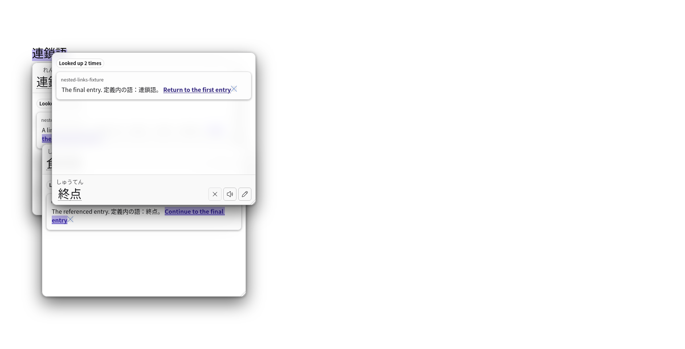

# Architecture

Hachidori shares one WebAssembly dictionary engine and extension codebase across
Chrome and Firefox desktop. Chrome uses a Manifest V3 service worker
and offscreen document. Firefox uses a Manifest V2 persistent background page
with the same offscreen page mounted as a hidden iframe.

## Runtime layout

```text
web page
  └─ content.js
       ├─ scans Japanese text near the pointer
       ├─ renders the popup in a closed shadow root
       └─ appends popup Note entries to the managed custom source

settings.html / content.js
  └─ extension runtime messaging
       └─ background.js
            ├─ Chrome: MV3 service worker
            ├─ Firefox: module loaded by persistent firefox-background.html
            ├─ owns chrome.storage.local dictionary metadata
            ├─ atomically owns the revisioned custom source document
            ├─ checks managed update indexes and owns one next-due alarm
            ├─ owns two retained daily snapshots and their next-due alarm
            ├─ Chrome: creates or reconnects to offscreen.html
            ├─ Firefox: waits for the authenticated persistent iframe
            └─ relays requests without holding engine state
                 └─ offscreen.js
                      ├─ probes pthread, shared-memory, and direct-OPFS support
                      ├─ primary: engine-worker.js
                      │    └─ pthread Wasm + WasmFS direct OPFS
                      ├─ no OPFS access handles: engine-worker-idbfs.js
                      │    └─ pthread Wasm + classic FS + IDBFS
                      └─ fallback: engine-service.js
                           └─ single-thread Wasm + IDBFS
```

Chrome’s service worker can be terminated after an idle period without
discarding loaded dictionaries. A later request recreates the routing context
while the offscreen engine remains authoritative. Firefox keeps both the
background page and its hidden engine iframe alive. Runtime requests carry
explicit IDs, generations, and result message types so stale or malformed
replies fail closed.

## Primary engine path

On supported Chrome builds, `offscreen.js` starts a dedicated module worker after proving all three capabilities:

- `crossOriginIsolated` and shared `WebAssembly.Memory`;
- module workers;
- a synchronous access handle from the origin-private file system.

`engine-worker.js` loads the pthread WebAssembly build. WasmFS mounts direct OPFS at `/dicts`, so the C++ engine reads its generated indexes without copying them through IndexedDB or the JavaScript heap. The extension manifest supplies the cross-origin isolation policy required by shared Wasm memory and exposes the generated pthread worker asset.

The worker serializes engine mutations and bounds pending requests. Imports,
reimports, managed replacements, custom saves and Note appends, removals, and
reloads cannot race each other.
The offscreen bridge reserves one of its existing 128 pending-request slots
before awaiting capability selection or fallback module loading. The same
admission and mutation lock cover both backends: while a mutation is pending,
other non-status requests fail busy. A saturated or mutating bridge answers
status from its last-known snapshot; before backend selection this snapshot
reports loading without claiming a storage backend. Normal status requests
still reach the engine, including its reload recovery path.

Replies, local handler failures, and thrown worker dispatches release their slot
and mutation lock through one settlement path. Engine startup or worker failure
settles every admitted request once; a late worker reply cannot settle it again.
There is no mutation deadline: a slow custom append must not appear failed while
it can still commit. This admission limit is a transport bound, not a dictionary,
archive, source-document, or background-storage-queue limit.

## Compatibility path

If shared Wasm memory and workers are available but direct OPFS is not, `offscreen.js` starts `engine-worker-idbfs.js`: the same pthread engine on the classic Emscripten FS with IDBFS mounted at `/dicts`. Electron (the GameSentenceMiner host) is the known case: it exposes cross-origin isolation and shared memory but refuses OPFS sync access handles to `chrome-extension://` origins. Imports keep the bounded eight-thread worker group (Jitendex imports in about 1.6 s instead of 3.9 s single-threaded), and the offscreen document's own thread stays free for audio and Anki work during an import. `hd_status` reports `threaded: true` and `storageBackend: "idbfs"`.

If shared Wasm memory or workers are unavailable, `offscreen.js` loads the single-thread WebAssembly module locally. That build mounts IDBFS at `/dicts`, restores it before opening dictionaries, and synchronizes generated files after a successful import.

Both IDBFS paths are intentionally explicit: `hd_status` reports `storageBackend: "idbfs"`, with `threaded: false` only for the single-thread runtime. The production benchmark rejects either when it is measuring the primary Hachidori path.

## Import transaction

Each dictionary import follows one logical transaction:

1. `settings.html` sends the next local ZIP with `hd_import`, or the shared offscreen installer sends the next missing catalogue source's pinned archive URL.
2. The service worker transfers the archive to the offscreen document.
3. The engine worker imports Yomitan banks through the Hoshidicts C++ importer into a fresh `/dicts/.hdw-generation-<UUID>/<title>` root. A committed root is never overwritten in place.
4. The generated files are flushed to the storage backend before metadata can reference them.
5. The candidate's exact manifest path is strict-loaded, including disabled packages, before the service worker compare-and-set commits it. A package already committed at its path that no longer loads does not block the candidate; see below.
6. Only a confirmed commit publishes the new dictionary count and generation.
7. The engine re-reads authoritative state before garbage-collecting unreferenced generation roots.
8. The settings page renders success only after that reply.

Multiple selected local archives remain separate transactions. Settings runs
them sequentially, keeps an outcome for each file, and continues after a failure.

While the experimental **MDX dictionaries** flag (`options.experimental.mdxImport`)
is on, the same picker and drop zone also take MDict files. Settings groups one
`.mdx` with the `.mdd` files named after its stem (`Dict.mdd`, `Dict.1.mdd`, …,
case-insensitively), sends them as one `hd_import` whose `resources` list the
MDD blob URLs, and reports a `.mdd` without its `.mdx` instead of importing it.
`resources` are accepted only on an ordinary local import of a `.mdx`. The engine
service stages a Yomitan ZIP at its fixed scratch name, but an MDX under its own
file name inside `/.hdw-mdx` with the MDD files beside it, because Hoshidicts
finds resource files as siblings of the `.mdx` stem and falls back to that stem as
the title; the directory is removed with the import. `hdw_import` decides the
format from the file's first bytes like the importer does: a Yomitan archive's
declared title is still read out of `index.json` and checked before the import,
while an MDict title comes from the engine's sanitiser, which yields one plain
path component, so only the post-import folder-name check applies to it. An MDX
package is otherwise ordinary: its glossaries are structured content converted
from the entry HTML, its MDD assets live under `mdict-media/`, and its revision is
`mdx import`. There is no interactive duplicate review for MDX files: a same-title
import replaces the installed package in place, as a re-import does.
Recommended installation uses the same offscreen runner from both Settings and
startup: either page attaches with `hd_setup_install`, and the run continues when
that page closes. `recommended-install-client.js` observes ordered progress and
reconnects after a quiet interval; linked Settings observes the host's runner
through Sharing. Both pages render the same byte/phase progress model. The engine
downloads catalogue-pinned archives directly and validates the final URL, title,
update index, revision, and defining capability before publishing source metadata.

If a compare-and-set result is unknown because both the commit reply and its readback fail, both the previous and candidate roots are retained. Revisioned manifest paths are authoritative on restart: the engine loads those paths and removes unreferenced generations rather than adopting them from disk. A committed package that no longer loads (missing or damaged files) is left out of the loaded set rather than failing every lookup: its row stays in the manifest, `hd_status.failedDictionaries` reports its `id`, `title` and load error, and Settings names it until it is re-imported or removed. Only packages a mutation introduces must load before they are committed. The IDBFS startup path also resolves imports left by the older `.hdw-import` protocol. The archive input itself is not retained.

Removal first loads the remaining manifest, then commits it, publishes the
new state, and finally garbage-collects the removed generation. The
`/dicts/.hdw-remove` handling remains only for recovery of dictionaries stranded
by the older removal protocol, including a legacy dictionary whose real title
was `.hdw-remove`.

## Automatic backup cycle

`automaticBackups` is a schema-versioned service-worker-owned index containing
at most `automaticBackupDays` records (a reader option, default 2), pruned when
the next record is written. Each record carries the same five-key snapshot and
lookup-statistics rows used by manual backup, but references committed immutable
dictionary generation paths instead of copying their files. Snapshot creation
runs inside the background storage queue, captures its timestamp after reaching
that queue, writes the replacement index once, and schedules
`hachidori-automatic-backup` for 24 hours after the committed record. Concurrent
triggers share that serialized result. An absent key becomes schema version 1;
an unsupported future schema is left untouched.

The index is authoritative before cleanup. A refused metadata write performs no
generation deletion. A lost reply is successful only when exact readback matches
the replacement; an uncertain result retains all roots. After confirmed
replacement, cleanup is best effort. Every normal cleanup and restart asks the
service worker for roots referenced by both retained records and skips deletion
when the index or any record is invalid. Shared roots occur once on disk.

Settings lists valid records independently, so a corrupt newest record cannot
hide an older fallback. Automatic restore validates generation paths before any
filesystem read, validates the referenced files in place, and then uses the
manual restore transaction and explicit replacement confirmation. Open Settings
refreshes when the index changes and after a persisted page is restored.

Linking clears the local automatic-backup alarm and suppresses snapshots of the
host mirror while retaining the local index. Unlink restores the kept local
state before reconciling local snapshots and scheduling again.

## Managed update cycle

The service worker derives managed candidates from `dictionaryState`, including
disabled packages. Recommended candidates use the source pinned in the built-in
catalogue; generic candidates need complete credential-free HTTPS index and
archive descriptors. These trust and schedule rules live in one native ES
module shared by the worker, engine, and Settings page.

**Check now** fetches each candidate's index and records `up-to-date`,
`update-available`, or `check-failed` against that package generation. It does
not download archives. The global Off/hourly/daily/weekly/monthly setting is the
default; each managed package can inherit it or choose its own interval or Off.
One nonperiodic Chrome alarm targets the earliest package due time and
automatically installs available revisions, including those for disabled
packages. Explicit package intervals work when the default is Off. See
[update schedules](update-schedules.md) for due-time and reconciliation behavior.

`dictionaryUpdates` carries a monotonic revision shared by schedule and
last-checked writes. Settings debounces schedule edits for 150 ms and sends one
revision-checked save at a time. It adopts only newer committed settings from
initial reads, storage events and replies; queued edits advance through their
own save's revision. A conflict or lost reply retains the draft for explicit
retry or discard. The schedule control stays disabled until a committed revision
is loaded, and queued drafts remain visible in the navigation status. Retrying an
already committed schedule reconciles the alarm
without another storage write. Alarm work never holds the storage-write queue.

An install carries the checked package ID, generation path, installed revision,
source descriptor, check time, expected remote revision, and selected archive
URL into the engine mutation queue. Recommended archives remain
catalogue-pinned; a generic index may select a different credential-free HTTPS
archive URL. The engine validates the response's final URL and generated index,
then revalidates the complete fingerprint at the commit snapshot. The fresh
generation and its `up-to-date` status are published in the same package CAS;
an ordinary reimport clears generation-bound check state. A stale check or
failure status is applied only while its captured fingerprint still matches.

The background storage queue is not held while the offscreen engine downloads,
imports, or commits. Presentation-only edits may advance state during that work,
so the engine cleans generations against the latest authoritative package paths
after publication. A title collision, changed fingerprint, wrong archive
revision, or failed import leaves the working generation loaded and reports the
failure without publishing the candidate.

## First-run setup

`chrome.runtime.onInstalled` with `reason === "install"` is the only entry to
onboarding. Inside its serialized storage queue the service worker seeds the
values that are still absent in one write, then opens one `startup.html` tab
only when it created the setup record. Chrome reports `install` again on every
launch for an unpacked extension loaded from the command line, so the absence
of that record, not the reason alone, identifies a new installation.
[Overlay mode](overlay-mode.md) skips this path and only seeds the initial
options on worker start.

- `setupState`: `{ schemaVersion: 1, revision, startedAt, stage, completedAt,
  dictionaries, anki }`, where `stage` is `welcome`, `dictionaries`, `anki`, `practice` or
  `complete`, `dictionaries` holds `{ outcomes, totalSeconds, continued,
  selectionsApplied, recordedRuns }` and `anki` is `null` until the Anki stage
  settles once as `{ status, detail, model, deck }` with `status` one of
  `configured`, `already-configured`, `unavailable` or `needs-attention`. A
  configured outcome names the model and deck and carries no reason text; the
  other two carry a non-empty reason and no names, so no view can render an
  empty or absent one.
  The worker owns every write. `hd_setup_cas` accepts
  `{ baseRevision, stage, continued? }` from the exact startup page URL only,
  answers a stale base revision with a conflict and the current state, refuses a
  stage that is not later than the current one, records `completedAt` when the
  stage becomes `complete`, and records `continued` when the user leaves the
  dictionary stage with an incomplete set.
- `options`: the first-install preferences (`showCompactDefinitionSummary: true`,
  `compactDefinitionSummaryCount: 2`) at revision 1. The `reader-options.js`
  defaults are unchanged, so an extension update never alters an existing
  user's popup, and a later edit through the ordinary revisioned options write
  is the value that persists. Anki settings contain an ordered
  `anki.templates` list; the first Template is also projected through the
  legacy flat Anki fields. `customButtons` contains ordered link or Anki
  actions, while `customLinks` is its link-only compatibility projection.
  Each field-template value is opaque user text: Settings offers marker
  suggestions through an editable combobox, but storage, Template switching,
  backup/restore, linked projection and note generation retain the exact
  string without trimming, canonicalizing or deduplicating it. See
  [Custom buttons and Anki Templates](custom-buttons-and-templates.md).

New installations begin at `welcome`, which discloses local page processing,
lookup statistics, publisher downloads, configured Anki metadata discovery, optional
pronunciation sharing, mining and explicitly started capture. **Start setup**
uses the ordinary revisioned stage write to enter `dictionaries`; automatic
downloads and the later Anki check wait for that successful write. The worker
also refuses startup's downloads and Anki checks while the stored stage is
`welcome`. Explicit installation in Settings works independently of onboarding.
**Set up manually** advances directly to `practice`, where an empty
library links to Settings without downloading or checking Anki. The
[privacy policy](privacy.md) in the repository is linked from setup and Settings.

Previously stored setup stages are preserved, so an accepted or existing run
resumes through the same installer attachment path without asking again.
Extension updates, browser starts and service-worker restarts only run
`warmUp()`; they cannot reopen setup or reset preferences. Setup state is not
part of a backup: it describes this installation's onboarding, not user data.

`startup.html` links the shared `render/reader.css` palettes and `settings.css` for typography, controls,
focus rings and reduced-motion rules, and adds only layout in `startup.css`. The
same `applyPageTheme` helper used by Settings applies the saved popup theme on
initial options load and each newer options revision. Before nearby Sharing
discovery, startup checks the current Sharing status with Settings' shared
eligibility rule: a hosting or already-linked installation never probes itself.
The page reads `setupState`, `dictionaryState` and `options` from storage, adopts
only newer revisions from storage events, and renders one card per stage under
a **Dictionaries → Anki (optional) → Try it** indicator (`aria-current="step"`). Continue
and Finish send `hd_setup_cas` with the revision the page rendered; a conflict
adopts the newer state and reports it in the card's live region, unless that
state has already reached the requested stage — a second tab making the same
move is the move this page asked for, not a failure — and a storage
event that arrives while a write is in flight renders once with the reply. A
stage change moves focus to the card heading; an inventory or progress update
keeps focus on the control that had it. Dictionary rows and their progress
elements remain mounted while their text and values change. The practice scene
also stays mounted across same-stage updates, preserving reader ranges, popup
anchors and Note drafts. Heading changes and settled dictionary outcomes are
announced; bytes and countdown ticks are not live announcements. Finish records
completion and closes the tab; if closing fails, a completed view stays readable
with its Settings link. Settings shows **Resume setup** in its sidebar while
`stage !== "complete"`, so closing the tab loses nothing.

### Dictionary stage

The offscreen document owns recommended installation for both startup and Settings. `setup-installer.js`
runs one sequential batch at a time: for each requested catalogue source it
rechecks the committed inventory through `hd_state_read` (a source installed
meanwhile is **Already installed**, never imported twice), waits for the engine
to be ready and idle, and dispatches an `hd_import` through the same admission
and mutation lock as a relayed request. That import carries only `sourceId`
and the catalogue-pinned `archiveUrl`; `prepareImportRequest` accepts this
remote first-install shape beside the managed-update one, `fetchImportArchive`
still validates the response's final URL, and the commit path applies the
unchanged recommended-source checks. The engine streams the body into its
filesystem and reports `downloading` progress about ten times a second with
the received bytes and a `totalBytes` that is set only when `Content-Length`
is present and no `Content-Encoding` makes it incomparable, then one
`installing` phase, because `hdw_import` is a single native call without a
progress callback. In the threaded engine these reports travel over a
fire-and-forget `engine-progress` worker channel; the compatibility engine
calls the sink directly. **Installed in X seconds** is reported only from the
import reply, which follows the strict load, the CAS commit and generation
cleanup. A run that meets another mutation's lock waits for the engine to go
idle again instead of failing the row, and rechecks the inventory after that
wait: a source Settings committed meanwhile settles as **Already installed**
rather than being downloaded and imported twice.

Startup and Settings attach with `hd_setup_install`, relayed by the service
worker for those extension pages (or a linked Settings request), and receive the current run
snapshot: an active run is returned to every requester, so a reconnecting page,
a duplicate tab or a restarted worker cannot start a second batch. Live rows
follow `hd_setup_progress` broadcasts that name the run and carry a sequence;
the page adopts only newer events for the run it attached to. Every catalogue
source without a recorded outcome is requested, so a missing one installs by
itself and an installed one is recorded as already installed — which also gives
a package whose commit outlived the installer that made it its durable outcome
and its first-install selection. A source whose recorded outcome is a failure
but which the current inventory holds — the user installed it from Settings
after the automatic attempt failed — is requested the same way, so the
installer records it as already installed without importing anything and the
stale failure no longer holds up the complete result. A failed source that is
still missing, or one removed later, waits for **Retry missing dictionaries**,
which requests only the missing ones; a request
the worker does not answer is reported once with the same Retry, never
re-requested on a timer. A run does report at every phase change and about ten
times a second while a body arrives, so a longer silence means the offscreen
document that owned it is gone: the page then observes the installer again with
an empty request, which starts nothing. A live run answers with its own
snapshot and keeps the progress the page already applied; a replacement
installer answers with an empty, finished one, and the sources without a
recorded outcome are requested once more instead of leaving a screen that can
never change. The installer records every outcome and each run's summed
installation duration through `hd_setup_record`, which the worker accepts from
the offscreen document only. A run in which startup participates updates its
onboarding record; a Settings-only run leaves onboarding intact. Both apply
initial dictionary selections, including on an overlay installation without a
setup record. A row settles only after that record is acknowledged: a lost
reply or a restarting worker makes the installer resend the same record with
backoff, and records are idempotent per run (`recordedRuns`), so a duration
whose reply was lost is confirmed rather than counted twice. The last row's
record carries that installation duration with the outcome, so a document terminated
between the two can never leave every outcome settled with the run accounting
missing, which nothing could reconstruct. Outcomes replace
earlier ones, installation durations begin at the engine's `installing` phase
and accumulate into `totalSeconds`, and a
committed Jitendex or Bee's entry settles its first-install selection once
(`compactDefinitionSummaryDictionary` and the term-route
`kanjiClickDictionary`) while that option is still Automatic, through the
revisioned options write. Installation-local `recommendedDictionarySelections`
remembers consumption independently of onboarding, adopting an existing setup
record's consumed selections on first use. Each catalogue entry's `firstInstallOption` declares
that option; `setup-state.js` owns only how its value is built from the title. That entry is located by the same catalogue identity
the installer uses — stored source ID or exact update index — so a package
imported by hand or carried in from another profile settles its selection from
its own committed title. **All dictionaries installed in X seconds** is
rendered only when the current inventory holds every catalogue source and this
setup installed at least one of them; a profile that already carried them all
reads **All dictionaries are already installed**. Either result advances to
Anki immediately. If both automatic writes are refused, the result keeps an
explicit **Continue now** instead of saving again by itself. The page explains
that installation continues after closing the tab and can be resumed from
Settings. **Continue setup** with missing sources
records `continued: true`. Only settled outcomes are announced, never bytes.


### Anki stage

Settings → Anki also exposes **Find existing setup** for later recovery and
overlay installations. Its explicit `hd_anki_setup` request uses the same
read-only detection/verification as startup, without reading or writing an
onboarding outcome. An unavailable result can be retried after opening Anki.
Settings applies a new proposal only while the Anki draft it checked is still
current, using its ordinary revision-checked options save; saved mappings are
verified and preserved. Connection refresh remains the lighter metadata check.
While linked, Settings first commits any pending Anki draft to the host and the
host runs both checks from its saved mapping, URL and API key; no client
endpoint or mapping is admitted by the sharing request.

After the welcome disclosure and **Start setup**, the Anki stage checks for an
existing mining setup by itself. The startup page
asks the worker once with `hd_setup_anki`, accepted from the exact startup page
URL only and answered outside the storage queue, so a read-only AnkiConnect
conversation never holds up a commit. Duplicate startup pages share the one
detection in flight, and a settled outcome is returned to every later caller
without asking Anki again.

`anki-setup.js` holds that discovery, and it only reads. `modelNamesAndIds`
names the candidates: a model qualifies when a supported family (Senren, Lapis
or Kiku) leads its name and ends at a word boundary, so `Kiku v2` and
`Lapis-1.4` match while `Kikuchi` and `My Kiku` do not. Each candidate's
`modelFieldNames` must satisfy the same preset mapping Settings would apply
(`applyAnkiPreset` and `resolveAnkiTemplates`, validated through
`ankiAvailability`), and that mapping must cover the family's core — the
expression, its reading, the sentence and a definition body — so a namesake
that happens to carry one recognised field is dropped rather than adopted. `findNotes mid:<id>` counts each
surviving candidate's distinct notes and the unique maximum wins; a tie, an
unused note type or no candidate at all is a **needs-attention** outcome with
the specific reason. The winner's deck is chosen the same way from
`findCards mid:<id> -deck:filtered`, `getDecks` and `cardsToNotes`, so
temporary filtered decks are excluded and the deck holding the most distinct
notes wins. No write action is ever issued: nothing in the collection changes.

The package-facing preset contract is checked independently against the
complete Kiku 2.1.0, Lapis 1.7.0 and Senren 5.1.0 APKG schemas. The bounded
read-only extractor and weekly pinned/latest workflow are documented in
[Anki note-type compatibility](anki-note-type-compatibility.md). Schema checks
cover field identity, order, values, overwrite modes, blanks and markers; they
do not execute card templates or prove rendering and media playback.

The worker records the outcome, and for a `configured` proposal it saves the
model, deck and resolved field templates through the ordinary revisioned
options write in the same storage write as the setup record. A mapping the user
already had is never replaced and is checked rather than assumed: instead of
proposing anything, `verifyAnkiSetup` reads the note types, the decks and that
model's fields and applies the shared `ankiAvailability` rules, so a complete
mapping is **already-configured** and a half-made one — choosing a note type in
Settings clears its fields — is **needs-attention** carrying Anki's own reason
(for example *Map the first field, “Front”, before adding notes.*). A saved
mapping that could not be checked at all is not claimed to be set up: the
connection's own reason is recorded and the mapping is left untouched. The latest options are read again inside that write: a mapping the user changes
while the check runs makes that check stale, so the write is abandoned and the
mapping now stored is checked instead. A proposal is saved only while the
mapping it was derived from is still the one stored, and a mapping that keeps
changing across three passes settles as **needs-attention** saying so rather
than recording a result for a mapping that no longer exists. A connection that does not answer or
times out is the ordinary **unavailable** outcome; any other failure keeps its
own reason. The page renders the settled outcome as one sentence with a link to
the Anki section of Settings, and that outcome moves setup to the last stage by
itself and stays readable there. A request the worker does not answer is
reported once with **Retry** beside **Continue setup**; the page never re-asks
on its own. If the worker's saved outcome still arrives around a lost reply,
that authoritative outcome retires only the stale request error. Anki is
explicitly optional. **Continue now** is available during the check; its
eventual reply adopts the latest recorded stage without moving the user back.
A failed connection says **Anki isn’t connected**, rather than claiming Anki
is absent. A successful automatic configuration keeps each of
its three progress steps visible for two seconds. The chosen model appears on
the first step and the chosen deck on the second as that staged result is
displayed. Every settled outcome remains for three seconds before setup
continues to practice.


### Practice and saved pages

`startup-practice.js` supplies the **Try it** scene and a Japanese passage about
a street like those shown in the backgrounds. The scene and Design preview share
`visual-novel.css` and the repository owner's supplied artwork, preserved
unchanged. Its sources and copyright declaration are recorded in
[asset ownership](asset-rights.md). The longer practice passage has a readable
dialogue surface that grows with its text at narrow widths.

The practice view loads the reader once after proving the exercise can be
answered. `startup.js` takes the complete dependency order from the manifest's
`content_scripts` entry through `chrome.runtime.getManifest()`, skipping only
`reader-options.js`, which the startup module already loaded. This includes
new reader dependencies such as the media-capture collector without maintaining
a second static list. `content.css` comes with the page; no reader scripts load
during the dictionary or Anki stages. Script loading also waits for the reader's
`HDReaderReady` promise: its initial dictionary/options snapshot must be adopted
before the automatic selection, or that late snapshot could invalidate the
example lookup immediately after it starts. Hover instructions follow
the active mode and activation key. The **Look up 辞書** button focuses the
sentence, selects that word and invokes the reader's explicit selected-text
command through the reader readiness API, so it also works from the keyboard
without pretending the user held an activation key. When the final step first
becomes answerable and the reader is ready, the page invokes that same command
once to demonstrate the lookup immediately. The button appears only when that
exact selection can be answered. All exercise lookups use ordinary
runtime messages, the installed dictionaries, WASM, popup renderer and styles.
No sample result is substituted. Among extension pages the reader permits only
this extension’s `startup.html`, with either no fragment or the native skip
link's `#setup-heading`. Query variants, unknown fragments, Settings and the
static design preview remain excluded. The skip handler focuses the heading
directly; a fragment created before it attaches still works after reload.


The shared `visual-novel.js` picks one of six local images at random when each
scene is created. A small **Next background** arrow cycles through them and
wraps to the first. It changes only the scene background and dialogue colors,
keeping the passage and Design popup mounted; no selection is stored. Images
load as selected. The startup arrow can retain keyboard focus while the reader
looks up the dialogue; ordinary page controls still pause hover. Pointer clicks
outside the real popup retain its usual dismissal behavior.

The startup passage's opaque surface follows the light or dark scene palette
so its text stays readable on every background.


Before inviting a lookup, the page probes **辞書** with the reader's selection
payload: the word's length and a full matched-text result. If it misses, the
page probes the actual displayed passage with ordinary `hd_lookup` requests
from successive character offsets, using the reader's configured scan length
and stopping at the first hit. A hit on another passage word keeps the exercise
and reader available, while hiding the unanswered shortcut and omitting it
from the instructions. No result is
substituted into the popup. The answer belongs to the engine-visible library:
each package's identity, title, revision, persisted generation path, enabled
state and term count, together with the lookup options sent by the probe.
Changing those retires the invitation and probes again; group-only and
presentation writes preserve the result and the connected scene. Turning
lookups off or removing every enabled term dictionary also retires an in-flight
probe. A library that cannot answer any word in the passage gets a dictionary
recovery link rather than an invitation. The heading reflects the current
readiness: add a term dictionary, enable an installed term dictionary, turn on
lookups, wait for the probe, or try the working exercise. Recovery uses a
prominent action to the relevant Settings section; **Finish setup** stays
available. The practice controller and page share this readiness decision.

A dictionary mutation can refuse lookups while publishing or cleaning up a
generation. The probe waits for `hd_status` to report a ready, idle engine and
then retries. Recoverable status failures are polled too, since polling drives
the engine's reload recovery. A failure that is still loading does not exhaust
the retries. An unreachable engine, repeated idle status failures or repeated
idle lookup refusals leave recovery and the mode-appropriate instruction for
reading on another webpage. The optional file-access controls and Finish stay
available while checking, after a miss and after an engine or reader failure.

Pronunciation uses the existing audio controller and offscreen player. The
worker routes startup playback feedback through extension runtime messaging,
since `tabs.sendMessage` targets content scripts. Before routing it, the worker
checks the current operation, Chrome-supplied document owner and offscreen
sender; the controller accepts only its active random request ID. Ordinary
webpage playback keeps its document-directed tab route.

The Anki outcome remains above the exercise. **Finish** and **Open Settings**
are available without performing a lookup. If no enabled term dictionary is
available, the page offers dictionary recovery; if lookups are disabled, it
links to Reading settings. A reader load failure offers reload or Settings.
These states do not prevent completing setup.

`local-file-access.js` shares the optional **Read saved pages too** controls
with **Settings → Reading**. It queries
`chrome.extension.isAllowedFileSchemeAccess()` before displaying the request
and shows **Local-file lookups enabled** only after Chrome reports access.
**Open extension settings** opens only
`chrome://extensions/?id=${chrome.runtime.id}` in a new tab and leaves the
instruction to turn on **Allow access to file URLs** and return. Opening the
details page grants no permission. The controller rechecks on page load,
visibility return and `pageshow`, ignoring superseded replies; returning with
access still off leaves the request available. Chrome can close extension tabs
when the switch reloads Hachidori. The instructions explain how to reopen
**Extension options** from the details page and choose **Resume setup**; the
existing persisted setup stage restores the exercise. This does not add another
automatic activation route. **Not now** dismisses it for the
current setup page and returns focus to Finish, without marking setup
incomplete. The bundled extension-page exercise never needs file access.


[The UI review](startup-ui-review.md) records before/after comparisons,
narrow layouts and the distinction between controlled screenshot states and
the real dictionary lookup checks.

## Hover activation and popup ownership

The reader has one live `hoverEnabled` switch and `lookupMode` (`hover`,
`activation` or `activationSticky`). The default follows Yomitan: hold the
activation key, Shift by default, and hover; the popup then stays open after the
key is released. `activation` instead closes the popup on release, and `hover`
scans without a key. `reader-options.js` translates legacy
`modifier` values into the canonical mode/key on read and accepts old Settings
patches through the same revision CAS. Explicit modern fields win, and selecting
Hover does not erase the remembered key. Canonical writes contain no competing
modifier policy. Letters, digits, punctuation, named browser keys and F1–F24 are
supported; browser/OS-reserved keys remain subject to their native behavior.

The existing 0–2,000 ms open delay defaults to 50 ms and also applies to a key
pressed over a stationary pointer. Hide/transfer delay defaults to the existing
160 ms, with the pinned source's 0–5,000 ms range. These are one global setting
pair, not per-dictionary policies. Zero hide delay dismisses immediately.

Disabled readers do not create pointer scan timers. Activation-gated readers
remember the pointer but do not scan or schedule until the key is held. Modifier
flags handle entering a tab while holding Shift/Control/Alt/Meta; a printable
key's physical code pairs its release even when Shift changes its character.
Repeated keydown is ignored, including Escape: a fresh Escape closes Note first,
then a separate press closes the popup. No page key is captured for activation.

Key release, target/window departure, outside click, Escape, blur and scroll
cancel delayed or unfinished pointer work immediately; the hide delay only
retains an already-rendered popup for transfer. In `activationSticky` a rendered
popup ignores key release, pointer movement without the key, an empty scan and
window departure; outside click, Escape, blur, scrolling its source away, a
failed lookup or a new lookup still close it. Same-candidate hover, popup entry,
keyboard focus and Note editing preserve the current view. Dispatching a different
valid pointer candidate retires the previous popup, matching the pinned reader's
`queueLookup` prune-before-send behavior: an obsolete view cannot accept a Note
or resume expired glossary/media callbacks. Interaction-only settings changes do
not invalidate current rendered resources; result-affecting settings still do.
Hidden retirement clears the DOM and owners immediately without a redundant
scroll reset; every visible term, kanji or notice render still resets scrolling.

Disabling explicitly closes even a focused popup or Note draft, while an already
dispatched Note append finishes its transaction without reopening or refreshing
the disabled reader. Settings changes reach existing tabs and persist through a
full browser restart without reloading the engine.


### Keybinds

`options.keybinds` copies yomitan-gsm's hotkey entries exactly: `action`,
`argument`, `key` (a `KeyboardEvent.code`, or `null` for modifiers only),
`modifiers`, `scopes` and `enabled`. Only actions that map onto an existing
Hachidori control are offered. Close, entry and dictionary navigation, Back, Add
note, View notes, Play audio, Play audio from source, Scan selected text, Scan
text at selection and Toggle option are available. The defaults are Yomitan's
keys for those actions: Escape, Alt+PageUp/PageDown (three entries),
Alt+ArrowUp/ArrowDown, Alt+Home/End, Alt+B, Alt+E, Alt+P and Alt+V.

Several Yomitan actions are omitted because Hachidori has no matching feature:

- forward history
- profiles
- the search page and its box
- card-format arguments
- copying the host selection, which the in-page popup never needs
- caret scanning inside editors

The content script matches a fresh keydown's physical code and exact modifier
set as Yomitan's `HotkeyHandler` does. The first enabled binding in scope that
handles the key prevents its default. Unmodified or Shift-only character keys
stay with a focused text field, and auto-repeat remains ignored.

Yomitan's popup scope means a popup that has focus. Hachidori's hover popup never
takes focus, so here the popup scope means a popup is open or its lookup is
pending. The page scope applies anywhere. Settings offers the scopes Yomitan's
controller offers for each action. Toggle option adds the page scope, because no
popup exists while lookups are off.

Close keeps the reader's Escape order and event handling. Popup actions target the
deepest visible popup. As in Yomitan, the current entry starts at the first entry
and changes only through navigation or a click on an entry. Navigation reveals
later entries through the existing Show more control. Dictionary navigation moves
from the most visible glossary card to the nearest card from another dictionary.
Add note, View notes and Back click the current entry's existing buttons, so
duplicate, disabled and capture behaviour is unchanged. Audio replays without
the click toggle, or plays the first choice from the selected source. Toggle
option writes one boolean through the revisioned options CAS.

The Keybinds section edits the list like Yomitan's key field: a key press
replaces the modifiers, a non-modifier key replaces the key, and plain Tab still
moves focus. Each row has Clear, Reset (the action's first default binding) and
Remove. The section also has Add and Reset keybinds to defaults.

Yomitan's native browser shortcuts are manifest `commands` for the features
Hachidori has:

- Turn Japanese lookups on or off, suggested as Alt+Delete like Yomitan's
  Toggle text scanning.
- Open Hachidori settings, unassigned.
- One unassigned command for each popup keybind action that needs no chosen
  argument: Close, Add to Anki, View in Anki, Play audio, the entry and
  dictionary moves, Back, and the two selection scans.

The worker toggles `hoverEnabled` inside its storage queue with the same
revisioned options write as the toolbar switch. A popup-action command goes to
the active tab as `hd_reader_command`. Every frame's reader runs the matching
keybind action, with a count of one for entry moves. Only a frame with an open
popup, or a selection for the scans, acts on it. Chrome alone can change these
shortcuts, as with Yomitan on Chrome. The Keybinds section lists
`chrome.commands.getAll()`, refreshes the list when its window regains focus,
and opens `chrome://extensions/shortcuts` (Firefox: `commands.openShortcutSettings()`,
since `tabs.create` refuses `about:addons`).


## Page scanning and exact selections

Dictionary keys longer than the configured scan length can still be found.
Hoshidicts' importer lists every key longer than 16 code points by its first
eight code points in a per-dictionary `scan.idx`, and `Lookup::lookup` extends
past `scanLength` only when the processed text begins like one of those keys, up
to that key's length plus eight code points for an inflected ending; other text
keeps the cost of `scanLength`. `packageFromIndex` records the longest such key
on the package row as `longKeyLength` (0 for packages imported before the index
existed). While the experimental **Long dictionary entries** flag
(`options.experimental.longKeyScan`) is on, the reader collects
`max(scanLength, longKeyLength + 8)` code points of page text across enabled
term packages, capped at 256, while still requesting `scanLength`; with the flag
off it collects `scanLength` as before, so the engine never sees a longer key.
Scans shorter than eight code points never extend, so a clicked-kanji lookup
stays one character.

Automatic scanning reads page text in DOM order regardless of layout, as
Yomitan's default layout-unaware scan does: it crosses inline and block elements
alike, including glyphs boxed one per absolutely positioned span by an overlay,
and stops only at `<br>`, editing controls or contenteditable text. The sentence
is the run of neighbouring text nodes around the hovered glyph, up to 200
characters each way, cut at a whitespace-only text node containing a line break
(the separator between blocks in page source and in overlays). Those text nodes
are the candidate's sources, so the highlight and the Anki sentence use the same
text. A focused page editor keeps printable
activation keys available for typing. Pointer lookups and modifier activation
still work over separate page text, including example links beside an
autofocused search field. The live `onlyScanJapaneseText`
option defaults to true; disabling it permits other scripts in automatic scans.
Repeated pointer events for one pending candidate share its lookup, while a
changed anchor/query or failed request can start fresh work.
Retained selections are rechecked through the existing pointer throttle rather
than rebuilding their visible string on every mousemove; selection-change and
mouseup lookups still dispatch immediately.
Focus checks follow nested open page shadow roots, and editor focus cancels both
delayed and already-dispatched candidate work. Closed page shadow roots expose
only their host through browser focus/event APIs; their private editors cannot
be inspected. The reader does not intercept shadow creation or block every
focused component to guess at those internals.

An automatic page selection takes priority over pointer scanning and bypasses
the language gate, but follows the same lookup mode and activation key as a
pointer lookup. Hover mode accepts an ordinary selection. Activation and sticky
activation accept it only while the configured activation key is held. Plain
selection or other modifiers alone do not look up, paint a source highlight or
expose the personal-definition pencil. As with pointer lookup, another modifier
held alongside the configured one does not disable it. Lookup waits until the
mouse drag ends. Once an activation-qualified selection is accepted, key release
does not discard it, so the popup and pencil workflow remain usable. Explicit
selected-text commands from keybinds and startup practice bypass this automatic
gate, while reader disablement and editing exclusions still apply.

The lookup sends the complete visible selected string without trimming or
truncation and accepts only results whose `matched` text equals that string.
Selection length overrides the configured scan length within the existing
engine scan window; a prefix-only result is not an exact match. A miss retains
selection ownership until the selection changes or is dismissed, so pointer
movement cannot silently replace it with a prefix. Its notice exposes the same
personal-dictionary pencil as term and kanji results, prefilled with the
selected word even when no dictionaries are installed. Saving uses the managed
Note append transaction and replays that exact request to show the new
definition; publisher dictionaries remain unchanged.

The visible query and raw DOM highlight span are stored separately: hidden text
and block separators can make `Selection.toString()` differ from `Range.toString()`.
Reverse/cross-inline ranges retain their exact source offsets. Selecting a
glossary inside our closed shadow root preserves the current view. Pending
selection replies share pointer cancellation and are rejected after dismissal
or relevant storage invalidation; that invalidation also releases completed hits
and misses for a fresh attempt with the new dictionaries or result options.
Initial selection replies also revalidate the selected text, so an in-flight
page edit cannot display an obsolete result. Escape dismisses retained misses
even when it is also the activation key. Note refresh and kanji Back replay the
stored exact descriptor even if editing has collapsed the page selection,
while an internal link uses its own query, reading and prefix-matching mode.
Visibility checks distinguish hidden subtrees (`display:none`) from inherited
`visibility:hidden`, whose children can restore visible text or editing surfaces.

## Frequency ranking controls

The generated Yomitan index's optional `frequencyMode` survives package metadata,
Settings presentation writes, reimports and reload reconciliation. Existing
packages recover it from their committed generation's index without a new schema
or WebAssembly build.

Selecting one enabled frequency dictionary saves its title and inferred direction
in one existing options patch: `rank-based` selects ascending; `occurrence-based`
or an undeclared mode selects descending. The explicit **Auto direction** button
reapplies that mapping. Manual directions remain unchanged during rendering,
metadata updates and restart. These are numeric directions, not universally
"common first" or "rare first" labels.

**Any** selects the existing native automatic mode, comparing enabled frequency
dictionaries in manifest order with numerically ascending values per dictionary.
It does not reinterpret mixed occurrence/rank metadata. **Disabled** bypasses
frequency ranking. Selecting Automatic or Disabled in the order control remembers
the inactive selected dictionary; choosing Any explicitly clears that selection.
Only an explicit dictionary selection or Auto action derives a numeric direction.

An unavailable choice remains visible until authoritative options change, with
manual directions and Auto unavailable. The background still prunes removed or
disabled dictionary references in its state commit; Settings does not race that
commit with a local rewrite. A focused chooser retains its native draft and CAS
base across incoming events, but refuses a choice that lost frequency capability
before the change event completes.


## Popup metadata controls

Design has independent controls for frequency source names and averages, pitch
contour and its preferred dictionary, pitch badges, and grammar tags. Frequency
metadata defaults to compact numbers without dictionary names. The first
result's frequency tags are the same Yomitan-like two-tone tags as every later
entry's metadata row; a filled source segment appears only when names or
averages are shown. Kana-derived values retain the visible Yomitan/Jiten `㋕`
marker, while source and numeric detail remain available on hover and to screen
readers. The tags sit inside the primary result, before its pronunciation
metadata and definition cards, instead of occupying the popup-wide headword
header or claiming a separate chrome row. The lower chrome row is reserved for
dictionary tabs and is omitted when no tabs exist. Grammar tags default to
hidden; opting in places them in the same result metadata group. Explicit saved
display choices are preserved.
Contour and pitch badges remain on, and averages remain off. IPA transcriptions
and definition tags remain visible independently. Every pitch badge draws its
dictionary's accent as the same mora contour the header furigana uses, followed
by the `[n]` position, so several pitch dictionaries compare at a glance; a
position outside the reading's morae keeps the plain `reading [n]` text, and the
text stays in every badge's tooltip and accessibility label. Pitch and IPA show
pronunciation data without source-name labels; tooltips and accessibility labels retain source
attribution and follow dictionary aliases. Unfilled tags and lightly tinted pitch
and frequency values use the theme's normal foreground, including light themes.
When IPA sources exceed the existing metadata display budget, a collapsed
disclosure builds their tags on first expansion. Every ordered transcription
remains available; this is lazy presentation, not a source or data limit.

Averages retain GSM PR #549's floored harmonic mean, with two corrections for
the standalone contract: arithmetic uses the native positive numeric value, not
its display label, and rank, occurrence and unspecified dictionaries aggregate
separately. Each dictionary contributes its first usable value once. Type labels
remain visible as concise `Avg rank`, `Avg count`, or `Avg frequency` text even
with source names hidden; individual dictionary names are not shown for an
aggregate. These display controls do not change native frequency sorting or
lookup results.

The preferred pitch source is a soft canonical-title preference: unavailable or
disabled sources fall back to another usable pitch source. A committed rename
follows the stable package ID, and actual removal clears the selection in the
same background options/state write. Turning contour off remembers the source.

Live metadata changes replace only changed metadata rows or expression ruby,
without another lookup, media request or glossary fill. Note drafts, full cards,
definition tags and deinflection disclosures keep their identity and state.
A focused kanji button defers ruby replacement until blur. The shared visual
context carries current preferences through deferred group changes, local tabs
and Show more; an unchanged delivery performs no metadata rebuild.


## Lookup statistics and definition blur

The reader displays a result before dispatching its independent statistics and
optional Anki maturity requests. Lookup statistics retain their serialized
descriptor-plus-term/reading-row transaction; neither the reader nor the worker
scans the statistics collection. See [lookup statistics](lookup-statistics.md)
for local recording, revision adoption and backup behavior. Lookup counts never
contact an external application; retired corpus connection settings are ignored.

`definitionBlurEnabled` remains the count criterion and requires
`showLookupCounts`. The independent, default-off
`definitionBlurAnkiMature` and `definitionBlurFrequencyEnabled` criteria
combine with it through the shared `definitionBlurQualifies` OR rule. Anki's
subject is the logical request's first canonical expression. Frequency uses a
request-owned snapshot of the primary result's canonical frequency groups, so
tab projections, Show more, Note refresh and Back reuse the same evidence.
Native kanji entries remain outside term blur.

The pure `definitionBlurFrequencyEvidence` helper is shared by the reader and
Design preview. It accepts only positive finite native `frequency.value`
numbers from the selected enabled dictionary; rendered labels are never parsed.
Automatic order maps `rank-based` to ascending and occurrence-based or
undeclared metadata to descending. Ascending compares the minimum value at or
below the threshold; descending compares the maximum value at or above it.
Missing, disabled, unavailable and nonnumeric sources fail open.

The worker answers both duplicate membership and `hd_anki_maturity` from one
local index, independently of the Anki mutation queue and dictionary engine.
The `ankiDuplicateIndex` storage key holds a snapshot, refresh attempt and
revision counters. Each word row is exactly `[wordKey, maturityFlag,
sortedNoteIds]`; rows never retain note fields, note-type names, deck names or
card data. The index is derived state and is excluded from backups.

The selected scope is one of the exact configured note type across all decks,
the exact configured deck and its subdecks across recognized note types, or all
of Anki across recognized note types. The configured destination is always
recognized; Kiku, Lapis and Senren-compatible note types are recognized from
their actual fields and templates. Only direct plain `{expression}` fields
enter the index. Operator-named fields remain excluded.


The dedicated `hachidori-anki-index` alarm refreshes the complete index when
the source changes and every 30 minutes while Anki mining remains configured.
Recording the attempt and next alarm before network I/O prevents worker
restarts from repeatedly retrying unavailable Anki: a pull records its outcome
on the attempt when it commits or fails, and only an attempt that never
recorded one — its worker or host stopped mid-pull — is due immediately on the
next worker start. Startup restores a missing alarm without resetting its due
time; an overdue attempt runs once. Triggers share one in-flight refresh.
Source changes invalidate old membership immediately, while policy-only
changes retain it. In overlay mode, and in any host without `chrome.alarms`,
the worker keeps every one-shot alarm on its own timers, because the Electron
host's `chrome.alarms` records alarms but never dispatches `onAlarm`.

A refresh resolves the scoped IDs and mature subset with `findNotes`, then
loads those IDs through `notesInfo`. Maturity means a review card outside
relearning with an interval of at least 21 days, matching
[Anki's mature-card definition](https://docs.ankiweb.net/getting-started.html#card-states).
A short-lived worker launched by the existing Anki offscreen service performs
that work and returns only compact rows. The complete replacement is built
outside the background storage queue, then its source and reserved revisions
are rechecked before publication. A repaired miss or confirmed write that
races a pull causes an immediate replacement refresh instead of losing the
new row. Failures retain the previous successful snapshot; a successful empty
result clears it.

Every mining flow uses the same lookup. In Prevent mode, popup readiness first
peeks at that canonical index using only the term and current configuration
digest. A warm positive exposes **View in Anki** with its exact note IDs without
Anki discovery, field rendering or any Anki request. A miss remains unknown and
falls through to the normal status and preflight path; its scoped live lookup
verifies the direct fields against Hachidori's exact word key, calculates
aggregate maturity and inserts a found row. A true miss creates no negative row.
AnkiConnect polls its socket on a timer, so each request costs one poll interval
and parallel requests serialise: discovery is one `multi` batch (`deckNames`,
`modelNames`, `modelFieldNames`), and the live lookup batches its candidate and
mature-subset `findNotes` searches before the single `notesInfo` stage. Both
index paths judge maturity on the same scoped card search, so in deck scope a
note is mature only through a mature card inside the configured deck.
Other duplicate policies retain their full preflight because Add duplicate and
Overwrite require live validation beyond membership.

Clicking **View in Anki** forces that same scoped live lookup before opening the
Browser. It replaces stale IDs in the canonical row, or removes an empty row and
returns the popup to normal addability checks; unrelated expression searches are
not opened for a known stale positive. Submission independently repeats the
lookup inside the mutation queue, so cache readiness never authorizes a write.
Confirmed adds and overwrites update the row immediately. Overwrite alone reads
`notesInfo` to select an exact configured-note-type target. Cross-type matches
may be viewed or prevented but are never overwrite targets.

Stored HTML stays literal, ASCII case is folded as in Anki's ordinary field
search, and lookup expressions use Anki's default NFC query normalization.
Maturity blur performs cache-only membership checks, including misses, so an
unrelated absent word never contacts Anki. Current visits retain their original
decision when a later snapshot changes, including visits retained for Back.

Each request owns one blur decision and the original first-display deadline.
Frequency can qualify synchronously before the first render. A nonqualifying
frequency leaves enabled count or Anki evidence pending; otherwise the request
fails open immediately. The first count snapshot controls that visit's blur;
later statistics rows cannot reverse it. The first audio result stays held
while definitions are pending or blurred, and the reveal, whether from the
decision, hover, the deadline or disabling blur, releases it once. A manual
play while blurred spends it.
Navigating away cancels only the live timer; Back and persisted `pageshow`
re-arm its remaining time. Revealed requests never reblur. Anki option changes
invalidate pending and completed maturity evidence through an options epoch,
including requests retained for Back, so late replies cannot revive it or
overwrite a current decision. The opt-in does not change the count-only path
when disabled, and unavailable Anki never delays the local lookup.

Settings uses the existing revisioned options queue. Three independent
checkboxes enable lookup count, mature Anki and frequency threshold conditions;
any checked condition can qualify. Count direction and threshold appear only
for the count condition. Frequency exposes one enabled dictionary, automatic
or explicit order and its threshold while retaining an unavailable saved
selection. A paused notice links to the count recording toggle when recording
is disabled. Any active condition shows the common reveal controls. The Design
preview passes fixed count, maturity and native frequency samples through the
same helpers, hover and timer without making lookups or Anki requests.

## Lookup response boundary

The native bridge rejects lookup text, primary reading, and frequency-dictionary
options above 4 KiB of UTF-8; term traces above 32 steps; a raw glossary above
8 MiB; and aggregate copied lookup strings above 32 MiB. It claims each string's
bytes before allocating its wire copy. The same copy pass detects control bytes;
only replies that need full control escaping use the serializer's larger
worst-case allocation. JSON serialization preserves every control byte, including
NUL, and independently rejects native responses above 32 MiB.

The engine service also checks the complete serialized public reply, including
its type, correlation ID, generation, and payload, against 32 MiB. A conservative
length bound avoids serializing ordinary native results twice; near the boundary
it measures the actual UTF-8 JSON without truncating fields. Invalid native
response envelopes fail instead of masquerading as successful misses. Correlation
IDs remain intact whenever the bounded error can fit; an ID that cannot fit even
that error is refused before lookup and receives a null ID. Shared error framing
also covers service-worker relay, offscreen busy/queue, and worker failures that
occur before the engine handler, without remeasuring successful relayed results.

An oversized or failed lookup leaves the loaded generation usable. The content
script clears the failed request's popup, but an older failed request cannot
hide a newer result. These are lookup transport bounds, not archive-size,
dictionary-entry, source-document, or media-count product limits.

Structured glossary traversal uses explicit frames, so valid content has no
renderer-imposed nesting-depth limit or JavaScript call-stack dependency. It
still rejects more than 1,048,576 visited values per glossary. Containers,
wrappers, and ignored values consume the same per-glossary traversal budget as
rendered text and elements; ordinary unknown-wrapper child text and literal
glossary fallback remain supported. A glossary that exceeds that work budget is
omitted without clearing the surrounding entry or other dictionary cards.

Each node-limit rejection reports its exact attempted value and configured
limit. Structural paths remain exact for ordinary content and elide the middle
of unusually deep paths, keeping diagnostics bounded without copying glossary
payload text. The popup adds the canonical dictionary title, stable package ID,
entry/definition position, and bounded term/reading before logging the omitted
definition. Unexpected renderer errors still reach the existing accessible
error and Retry boundary.

Deferred glossary fills and their layout callbacks belong to both the current
lookup request and the current result panel. A newer pending request, a tab
projection, clear, or destroy invalidates obsolete work before it can render or
request media. Initial synchronous renderer errors reach the content-script
catch; later tab, expansion, and deferred renderer errors clear only their
owning current view. Structured node-limit failures instead clear only their
partially rendered definition body.

### External dictionary links

`external-links.js` shares absolute HTTP(S) URL normalization between the classic
glossary renderer and module service worker. Credentials, embedded control
characters, malformed URLs and other schemes are rejected. The renderer retains
its existing 4,096-character href boundary; the gateway adds no product cap.
Current, connected anchors route click/Enter and middle-button activation through
the content script's correlated `hd_open_external` worker request. The captured
URL cannot be replaced by editing the DOM href. Handled nested actions do not
bubble into a second link, and stale anchors cancel native navigation too.

The worker independently validates URL, extension sender and boolean tab
activation, then calls `chrome.tabs.create` once in the sender's browser window,
without an opener, storage queue or engine relay. Normal and Shift activation
open a foreground tab; Ctrl/Meta or middle-click open a background tab unless
Shift is held. Shift deliberately opens a tab, not a separate window. A failed
or missing reply is logged without retry, native fallback or lookup/Note changes.
Safe hrefs and `noopener noreferrer` remain for Copy link and native browser
context-menu commands; those browser-owned commands do not emit routed clicks.
No dictionary frame, fetch, new permission or configurable action is introduced.

### Definition popup chains

Hovering ordinary text inside a rendered glossary opens a child beside its
parent. The closed shadow root is resolved with the native shadow-aware caret
API, then the ordinary page scanner's inline, ruby, whitespace, Japanese-only
and scan-length rules build the child query. The complete glossary remains the
sentence and offset coordinate space for mining. Headwords, metadata, compact
summaries, toolbars and controls are not scanned.

Activating a structured internal link uses the same child lifecycle, but keeps
the link's exact query and primary reading rather than its displayed label or
scan offsets. The revisioned `popupNestingMaxDepth` option defaults to 10
children; zero disables child navigation, and a nonnegative safe integer is
accepted without a second product cap. At the configured depth or without
drawable viewport space, activation retains the existing chain without
allocating a pane or sending a lookup. Lowering the depth prunes existing excess
descendants immediately.

One closed shadow host and stylesheet serve the chain. Each lazily constructed
level has a stable object identity, renderer, scoped source highlight, request
token, exact current request, kanji Back snapshot, and Note state. Pruned objects
are retired before clearing their hidden DOM or destroying renderer callbacks;
a late reply cannot acquire a replacement object at the same numeric depth.
The same pending/current source query reuses its child. Leaving definition text
cancels an unfinished hover child; clicked links continue independently.
Another source or a parent tab redraw prunes only that parent's descendants. A
child miss or failure does not dismiss its ancestors. Kanji Back first restores
that child's term request; its next Back closes the child and returns focus to a
connected source link when one initiated the lookup.

Keyboard link activation focuses the child's Back control; mouse activation
does not invent keyboard focus that would block pointer-return pruning. Returning
to an ancestor prunes descendants after the normal hide delay, unless a draft,
pending Note append, or deliberate keyboard focus still protects them. Pointer
transfer uses actual pane rectangles and narrow connecting gaps, with 80 ms grace
before resuming the current page scan. No layout is read in raw mousemove before
the existing throttle. Children prefer available space beside their parent and
clamp to the viewport; narrow screens may overlap panes. Layout callbacks start
at their owning level and reposition descendants without redoing ancestor layout.
Dirty panes share one animation-frame batch: each runs its own masonry before
one linear placement pass from the shallowest live owner in that same frame.
Width changes can queue a following ResizeObserver batch without losing work
or adding a separate placement frame. A single pane also lays out and positions
in one frame. Direct Note, image and navigation positioning remains synchronous;
renderer destruction, retirement and teardown cancel their queued work.

Popups and the image preview ignore browser page zoom. The content script asks
the service worker for `chrome.tabs.getZoom` at start and again whenever
`devicePixelRatio` changes on resize. It sets the inverse as CSS `zoom` on
those elements, so their lengths stay in unzoomed pixels. Placement multiplies
page client rectangles and the viewport by the zoom factor before clamping.
Pointer hit tests and source highlights stay in page coordinates.

The live **Definition columns** preference defaults to one and supports integers
one through four. Each glossary grid packs cards into its shortest column while
retaining their DOM reading order. Changing columns schedules the existing
owned layout batch for every visible pane; it does not invalidate lookups,
replace the result DOM or close a Note draft.
Cards include padding and borders in their assigned widths. The same resize
observer watches each grid as well as its cards, so a newly narrowed popup can
repack fixed-width cards. Each grid assigns all widths, measures the ordered
card heights, then applies placement, avoiding a forced layout per card.
Local projection disconnects the superseded panel's
observations before registering its replacements; Show more retains current
observations while adding the newly displayed entries.

Term views offer All, nonempty saved groups in their stored order, then
favourite dictionaries that do not already belong to a group. Other
contributing dictionaries remain available through All without receiving their
own tab, and grouped favourites do not receive duplicate dictionary tabs. Tabs
project the already-returned results without changing their order or sending a
lookup; aliases label tabs while canonical dictionary titles and stable group
IDs own their selections. Colliding labels are qualified without changing
membership.
Linked and clicked-kanji requests copy that selection from their source view.
The destination retains it only when it contributes results, otherwise adopting
All; a child's fallback or later selection never rewrites its parent or Back
snapshot. Native kanji entries use the same membership resolver as term tabs.
Content resolves saved group member IDs through the enabled package inventory
using the shared D7 normalizer, including while a lookup reply is pending.

Newer group, alias and favourite changes update the displayed view without
invalidating its lookup token, media or styles. A view that started without a
tab row does not create one when its first favourite or nonempty group is saved;
that row appears on the next lookup. Existing keyed tab buttons keep their DOM
identity and deliberate focus across renames and reordering. When the selected
membership is unchanged, only labels change: glossary cards, expanded Details,
metadata values, source highlights and Note controls remain mounted. Frequency
and pitch aliases use their original per-result canonical title sets, including
for results subsequently revealed by Show more.

A changed or removed selection reprojects the same native results only while
that request is still current and its content is unprotected. Open Note forms,
pending appends, focused content and children (including their initial pending
lookup) defer the latest presentation as one coherent tab row and projection.
Child retirement, settled focus departure and Note close retry that update;
real replacement renders discard it. Safe local projection preserves expansion
and refreshes Note's projected-primary prefill. Native kanji uses its own
original entries, never the prior term's Back snapshot. These local updates use
the existing render-error boundary and owned masonry queue, not a new lookup.
The content owner's normal request boundary also retires detached ancestors
before a local projection can fill a child whose source link still exists in
an obsolete parent popup.

Dictionary revisions, generation, media and style transport remain shared. A
changed accepted engine generation invalidates other level tokens, including
when a restarted engine reports a lower number. A same-generation child leaves
ancestor deferred rendering and resources current. Deduplicated queued media
retains every consumer predicate, so pruning one child cannot cancel a resource
still owned by its parent.

Note drafts stay in each existing renderer, not in a second draft model. Append
success adopts only newer global committed state and queues only the originating
level's exact replay. A parent replay waits while a descendant draft/append needs
its source DOM. Ancestors retained solely to anchor a refreshed child are not
automatically hidden when that child's Note closes; their obsolete asynchronous
callbacks remain invalid. Explicit accepted navigation consumes that level's
old deferred replay. Displayed-view ownership separately permits new linked
navigation from retained parents. A stale parent's tab action replays its exact
request with the selected tab before rendering current dictionary data. Stale
Show more uses the same replay with an expansion intent; repeated actions share
the pending exact request and token, retaining the latest tab/expansion intent.
Current-generation tab changes and expansion remain lookup-free. Neither action
reenables old deferred glossary or media work.

Only this same-view replay preserves live Note controls. It keeps the form
mounted, including a draft opened while the reply was pending, and replaces the
prefill reader for the next open without copying or resetting current values,
pending-save state or selection. Focus follows the response-time owner: a still
focused tab maps to its replacement, while a Note input or focus moved elsewhere
is not stolen. A protected failed or empty replay leaves the draft and retained
navigation usable. These transient replay options are never stored in kanji
Back snapshots. An append from a retired level still succeeds and adopts new
committed state, but never refreshes a new level at the same depth.




### Compact headword summaries

Design exposes an opt-in compact summary, a snippet count from one through six
(default three), and a preferred canonical dictionary title. Automatic uses the
first eligible dictionary in the current projected result order. The preference
is soft: disabled or unavailable titles remain remembered and visible in
Settings, while the current result falls back without enabling a package or
changing lookup ranking. Unlike frequency and clicked-kanji routing, this
preference is not pruned by package changes.

The existing semantic extractor skips metadata/examples, retains ordered unique
snippets and splits nonempty bullet-separated text. Fallback extraction retains
mixed plain and structured top-level senses in order, expanding
leaf blocks within each sense without discarding its siblings. Semantic marked
glossary sections and the first nonempty list retain precedence. Fallback
leaf discovery shares its budget across senses; exhausted discovery
still allows ordinary text fallback. Empty inline children need no block check.
Each inspected raw glossary is parsed once for text and leading-image selection.
Inline text parts stream
without concatenating unused text or matching/normalizing whole fragments.
One extra normalized code point beyond the 240-point display budget proves
truncation without mistaking a long candidate for a previously seen duplicate.
Adjacent inline parts retain split surrogate pairs and block separators. Native
bounded text-run searches skip empty bullet and whitespace runs without a
matcher call per character. Only each run's boundary needs a surrogate join
check; native pair counting keeps whole bounded runs as strings, building a
point array only when a run needs truncation. Full JSON parsing and necessary
whitespace-prefix scans remain. Only the first meaningful content can
supply the image: text, including zero/false, or an unsupported leading image
prevents searching for a later image. Text/structured wrappers
follow the glossary renderer's dispatch order through shared tag/payload helpers
used by discovery, text collection and leading-image selection. A real line break
separates text rather than becoming a sense leaf. Void/ignored elements cannot
expose hidden child lists or suppress a following leading image; wrapper-selected
text takes precedence over an incidental tag or unused content field.
Ruby annotations and their fallback delimiters are omitted from the plain summary;
the complete definition retains its native ruby markup.
Sanseido-style dictionaries (三省堂国語辞典, 新明解国語辞典 and bilingual
conversions such as sankoku en-jp) name sections with `data.name`. The same
discovery pass that finds marked glossary sections finds their 語義 senses; after
marked sections, each sense contributes only its 語釈 gloss, so sense numbers,
labels, examples and ルビG furigana stay out. A bilingual 語釈 is English, a bare
space child, then the original Japanese; the summary keeps the English half when
the text after that space opens with Japanese. Senses holding only a ⇨ reference
and index entries that are bare sub-headword links contribute nothing, so the
summary moves on as it does for Jitendex redirects.
Existing display/traversal bounds
apply only to this preview; native results and complete glossary bytes remain
unchanged. Default-off rendering does not run summary extraction.

A 36px thumbnail uses the existing safe image renderer and generation/dictionary
media resolver. Summary and full-card consumers share one in-flight request and
cache entry. Failed or unsupported images remove the thumbnail wrapper, leaving
a text-only summary; the full card retains its readable image error.
The tiny preview is always expanded; a dictionary's collapsed-image setting
still applies to its unchanged full definition.
Changing enablement, count or source updates only the summary subtree; expression,
Back, Note controls, full cards, focus and child anchors stay mounted. A focused
thumbnail defers its own replacement until the existing focusout flush. Deferred
headers use the latest presentation. Live summary work passes the existing
connected-request boundary before parsing, without adding that check to ordinary
media or layout callbacks. A replaced summary retires only its own media/preview
owner, not another card's current consumer.

The three options use the existing revisioned autosave and highest-revision
delivery. An external off change does not disable a currently focused count or
source control until focusout: Chrome would otherwise blur it synchronously and
discard a pending input-before-change draft. That edit still uses its captured
revision and surfaces a conflict normally; no second draft state is introduced.
Options and dictionary state in one delivery are adopted before summary work:
content invalidation takes precedence, while combined presentation changes apply
once against the new state. Startup uses the same ordering.


### Dictionary cards

Dictionary cards follow Yomitan: each is a plain box whose title shows the
dictionary's display name, and its definitions are always shown. The card is not
a disclosure and has no marker, so there is nothing to open before a definition
can be read.

Collapsing belongs to the dictionary. A structured-content `details`/`summary`
renders natively, closed unless the entry sets `open: true`, and is styled as in
Yomitan: the `details` is indented 1.4em and the `summary` keeps the browser's
own marker with `list-style-position: outside`, so the thin triangle hangs in the
gutter. A dictionary's own scoped `styles.css` can restyle it; Bee's Ultimate
Grammar Dictionary draws its own chevron on its per-source blocks this way.

### Deinflection explanation

Each eligible term header has a native, initially closed `details` disclosure.
It reads the raw matched/deinflected endpoints and ordered trace from the engine
response, preserving whitespace and repeated steps with text-only DOM nodes.
Equal or missing endpoints and traces without a nonempty step name produce no
disclosure. This presentation does not change normalization, the result object,
Note prefill, or the trace available to future consumers. Existing native trace
and response bounds apply. The renderer independently limits each visible value
to 4 KiB of UTF-8 and shows at most 31 named steps followed by an omission
marker, so a malformed response cannot create an unbounded popup tree.

The visible summary is the endpoint path. Accessibility labels use the browser's
English, Japanese, or Ukrainian base language, with English for other languages;
backend rule names and descriptions remain untouched. Additional result headers
are still created only by Show more. Tab projection creates a fresh closed
disclosure, and queued toggle positioning uses the existing render-revision,
panel, and request owner, including primary headers outside the result panel.
An expanded primary explanation scrolls inside the toolbar's bounded area;
definitions have a separate scrollport and never pass behind the toolbar.
Note and Back stay beside the headword. The Note form has its own bounded area,
so opening it keeps the focused field reachable even with a long explanation.

## Media response boundary

Media fetches bound the dictionary reference to 1 KiB and path to 4 KiB of
UTF-8. The engine service rejects embedded NUL before passing those references
through the C-string ABI. The native bridge checks the borrowed media view
against 4 MiB before copying it, and the service reads the native error before
interpreting a zero length as a successful missing-file response.

The complete serialized media reply is limited to 6 MiB, including correlation
and error fields. `response-limits.js` shares lookup/media correlation and
failure framing across engine, worker, offscreen, and service-worker paths.
The producer's fixed ASCII MIME prefix and base64 payload permit exact payload
length accounting without another full data-URL serialization; the remaining
envelope is measured as UTF-8 when its conservative bound is insufficient.

These are fetch and message limits, not archive admission rules. Larger media
still imports and strict-loads; only its fetch fails, leaving other media and
lookups usable. A well-formed missing file remains a successful null result.

`hd_media` requires the generation of its owning lookup. The serialized engine
handler checks it after loading and before native extraction, so queued media
cannot accidentally read a replacement dictionary. Only an accepted current
lookup/kanji response adopts the reader's generation; late media or styles
cannot roll it backward. A restarted engine may legitimately report a lower
generation number. The engine compares the term bank `path` with the archive
entry name byte for byte; the handler retries a miss with the NFC and NFD
spellings and the percent-decoded form of the path, because macOS-built
archives store decomposed Japanese names and some converters percent-encode
paths. Entry names in another byte encoding are not recoverable.

Image-source selection is independent of the dictionary supplying the text.
Automatic retains that dictionary's direct media path; an explicit dictionary or
named group supplies enabled, installed candidates in its configured order.
Each requested path falls through independently through the existing shared
cache/queue. A missing source or exhausted group fails normally; it does not
silently switch to Automatic. The effective candidate order owns in-flight
routing, so a changed route cannot publish stale bytes/provenance or start another
fallback. Alias and group-name changes preserve that identity and cached media.
Design's native Image source chooser stores canonical titles and stable group
IDs, with aliases and group names only as labels. Disabled or already-missing
selections stay remembered, including deleted groups. Removing the selected
installed package resets its image selection to Automatic in the same dictionary
state/options commit, with an options revision that rejects stale writers.
An ID-preserving title change migrates that selection to the new canonical title
in the same commit.
Inventory updates preserve a focused selection until focusout.
It uses the existing revision-bound autosave and is independent of the hover and
compact-summary toggles.

Source changes refresh each displayed image in place without reparsing its
glossary, replacing cards, or disturbing a Note draft. Simultaneous group or summary
changes adopt the new route before rebuilding without queuing media for discarded owners;
Note/focus/child deferrals still refresh their retained images. Image-local
attempts retire old success, failure and decode callbacks; Automatic also captures the
route identity at the shared resolver boundary. A failed compact thumbnail can
remount its existing wrapper under a new source while its summary text remains
mounted. Successful alternate suppliers get a small label beside the image,
outside the compact thumbnail's clip, using the supplier's alias and retaining
its canonical title. The image's completion callback positions the new label
with the image, without a duplicate early layout. Alias-only changes still
schedule their own layout and do not request media again.

The latest image context stays separate from deferred tab/text presentation
and survives local tab projection. Route changes enter the connected-request
boundary even while Note or a child protects that projection. Retained stale
parents may update existing labels but cannot admit new image work. A focused
image remains keyboard-focusable while its old URL is removed; preview reloads
resume only an undismissed owner, never a preview closed by failure or scrolling.
Once focus leaves, a failed image drops that temporary tab stop.


The reader separates reusable image resources from DOM ownership. Pending
fetches dedupe by generation, canonical title and normalized path; successful
data URLs stay reusable across hovers, including a fetch completing while the
popup is hidden. Missing or failed fetches are not cached. Package-content
changes and teardown drop cached resources and pending ownership; alias and
favourite edits preserve them. Job identity prevents an old completion from
removing or populating a newer same-key job. Styles similarly own their exact
request, even when a restart reuses the numeric generation.

Inline image sizing retains the source's existing width range (0.1–1,024 px or
0.1–64 em) and 10,000% sizer-padding maximum. The bounded percentage sizer is
the sole aspect-sizing rule: a second raw CSS `aspect-ratio` could bypass it
and make a one-pixel-wide image millions of pixels tall. Ordinary dimensions
and preferred/em sizing retain their previous geometry. This limits rendered
geometry, not imported image bytes or native dimensions.

Preferred-height width calculation keeps its original finite positive result.
Only an intermediate zero or infinity retries the other multiplication/division
groupings before the existing display-width clamp. This recovers representable
widths lost to floating-point overflow/underflow without changing ordinary
rounding or adding a new dimension limit.

Image fulfillment, failure and load/error callbacks require a connected image
in the current request and result panel before changing DOM or repositioning.
Failures expose the image's alt text and a readable message outside the image's
possibly tiny dimensions; a later hover retries. Back reuses its saved result
snapshot unless the generation or dictionary contents changed, in which case
it replays the exact saved request before restoring focus. Presentation-only
edits do not force a native Back lookup.


The media scheduler and cache use the pinned source's runtime bounds:

| Resource | Limit |
| --- | --- |
| Active media jobs | 4 |
| Total admitted jobs, including active jobs | 128 |
| Successful cached entries | 64 |
| Cached decoded media bytes | 16 MiB |
| Active request deadline | 4 seconds from dispatch |

Cache hits move entries to the newest LRU position. Exact byte and entry limits
are accepted; insertion evicts the oldest until both bounds hold. Decoded-byte
accounting uses the engine's base64 length and padding, without decoding or
copying image payloads. This is a cache-reference budget, not a bound on all DOM,
decoded-image, or browser memory. Data URLs cannot be revoked; eviction drops
the cache's reference without invalidating an already rendered image.

Queued jobs have no timer until dispatched. Current same-key consumers may
reattach queued jobs; obsolete queued jobs are skipped before dispatch and
pruned before rejecting a newer request for lack of capacity. Already-started
valid resources may still finish while hidden. Content/generation invalidation
and teardown detach the queue before settling old jobs. Settlement releases
timers and owned capacity exactly once, so late replies after timeout or
invalidation cannot publish bytes or disturb replacement jobs. Chrome runtime
messages already sent cannot be aborted: the deadline bounds logical ownership
and waiting, not underlying native execution.

Hovering or keyboard-focusing an image lazily opens one larger, fixed preview.
It is a sibling of the popup inside the same closed shadow root, so it inherits
the palette without being clipped by the glossary card or popup scrollport.
The preview copies the original image's exact current source and alt text; it
does not resolve media again or change inline dimensions. The shared positioning
function clamps it to the viewport with an 8-pixel margin. Pixelated and
monochrome presentation are retained, and reduced motion disables the animation.

Each popup owns one requested preview image, including a still-loading image.
A load may resume only that current intent: it cannot replace a newer
focus/hover preview or revive one dismissed during loading. Leave or blur
dismisses the appropriate owner only when neither hover nor focus remains.
Image failure, tab/view replacement, same-level pending navigation, settings invalidation
and teardown dismiss it regardless of those interaction states. Hover scrolling
closes the preview; keyboard-induced popup scrolling repositions a still-visible
focused owner.
There is no document-wide observer, polling or per-image observer.

Keyboard focus inside the popup cancels hover dismissal, while genuine focus
departure rearms it. Focusout waits for removal/focus transfer to settle so
replacing a focused Note form cannot schedule dismissal of its refreshed result.
Escape, outside clicks and a new lookup still explicitly dismiss or replace the
view. Real-WASM and Chrome checks import genuine AVIF and SVG resources and
verify exact bytes, MIME types, decoded dimensions and preview source reuse.


## Clicked-kanji navigation and Back

Design's clicked-kanji selector chooses a source and capability. An explicit
term source is restricted before native ranking and result limits.
A selected term lookup filters the engine's already-loaded query by its exact
dictionary path instead of reopening term and metadata dictionaries per click.
Frequency and pitch metadata still come from every loaded metadata dictionary.
A missing, disabled or empty selected source falls back to native kanji. For an
enabled native source with no matching entry, the already returned automatic
entries supply that fallback without another request. A terminal native miss
retires that popup level; a protected same-view Note refresh retains its draft.
Obsolete replies cannot dismiss or replace a newer view.

Back stores the exact term request and its current tab, expanded-results flag,
scroll position and disclosure states as data, not detached DOM or renderer
closures. The renderer-owned capture accessor follows local tab changes and is
cleared when the view is retired. Matching content and tab membership restore
open deinflection, structured and IPA disclosures.
Lazy IPA is populated before the restored layout. Changed content cannot inherit
unrelated disclosure states; a changed generation replays the exact request.

Scroll restoration runs once after deferred glossary bodies and masonry, only
for the current projection and while the reader has not deliberately scrolled.
Later tabs do not inherit it. Ordinary retained renders do not read scroll while
their replacement panel is empty: that layout flush can clamp a bottom Note's
scroll before its content is rebuilt. The content scrollport owns the saved
reading position. The existing highlight, toolbar positioning,
exact clicked-kanji focus target and previous Back chain remain intact.
Moving the toolbar to the other edge after a viewport resize preserves deliberate
tab or Note focus, including the existing draft selection.

This intentionally extends the pinned GSM PR #549 restoration: its saved term
view does not retain expansion/scroll, and uses the current kanji tab. Issue #9
requires the prior term view's exact state instead.


## Dictionary presentation boundary

Imported styles are parsed in a detached browser stylesheet, filtered, and only
then serialized inside a canonical-title `@scope` for that dictionary's glossary
content. Raw archive CSS is never concatenated around a scope boundary. Normal
style rules, CSS nesting, and media/supports/container groups are retained;
global definitions such as imports, fonts, properties, and keyframes are removed.

A rule containing resource functions, custom functions, residual CSS escapes, or
non-generic font selection is omitted. The whole declaration block is checked
because variable-containing shorthands expose empty CSSOM longhands before
substitution. Comment-like text inside strings is not stripped. Five color/size
compatibility variables support Jitendex formatting through color/math wrappers
at each variable use. Typing only the alias declaration is insufficient: a
page's registered `@property` can replace an invalid value with a URL-valued
initial value. Use-site wrappers also retain live theme changes without
re-fetching dictionary styles. Every other custom property belongs to the
dictionary, which can declare and reference it freely: Bee's Ultimate Grammar
Dictionary builds its card, including its disclosure chevrons, from its own
`--bugd-*` tokens. Those names are rewritten under a random prefix, chosen each
time styles are installed, in both declarations and `var()` references. The page
cannot read that prefix through the closed shadow root, so it can neither
inherit a value into one nor register an `@property` for it, and a reference the
dictionary never declares falls back as in a theme without it. Dictionary media
still uses the generation-owned `hd_media` path, not stylesheet URLs.

The trusted glossary card sits outside the dictionary scope and establishes
paint containment, so fixed descendants and oversized shadows cannot cover
reader controls. Style installation replaces the previous generation's elements
and remains deferred once per engine generation, not repeated on each lookup.

The real-Chrome fixture retains its ordinary structured formatting after containment:


## Settings interface

Settings is one document with native hash links and one visible task section.
The primary rail exposes ten destinations. Library owns five local,
hash-addressable task views: Dictionaries, Add, Updates, Groups, and Personal
dictionary. Backup and restore remains a global destination. Advanced is the
last destination and holds Experimental features: one switch per entry in the
`EXPERIMENTAL_FEATURES` registry in `reader-options.js`, stored as booleans
under `options.experimental` and saved through the same revisioned option
writes. A feature that names a Settings section keeps that section, its rail
link and its picker option hidden while the switch is off; a hash request for
the hidden section resolves to Advanced and is re-resolved when the stored
options arrive or change. The feature's own settings stay where they were, so
turning a switch off preserves them. The compact picker
keeps all fourteen task views available and groups those five Library choices.
Global search matches settings across every section, includes the Library
hierarchy in matching and result breadcrumbs, opens a result's enclosing
disclosures and focuses its control without changing values or discarding drafts.
The activation-key selector remains editable in either lookup mode.
All sections stay mounted, so navigation and browser history preserve reader
and personal-dictionary drafts. Personal source loads on first entering its section.
The rail becomes a compact section chooser in narrow windows. Settings applies
the saved lookup theme to its document and updates it immediately after local or
external option changes; startup pages retain their independent system light/dark
fallback. Inactive sections mirror pending work, errors, and unseen operation
completions next to their links. Visiting a section clears its completion notice,
not its source output or draft. The compact navigation mirrors inactive notices,
and shared options feedback stays near the section heading. Notices from Library
children are labelled and aggregated on the primary Library destination while
the local navigation identifies the active child. Status setters own these
notices; there are no observers or additional polling loops.

[The Settings UI review](settings-ui-review.md) records the layout decisions
behind this section, unedited browser captures of each state and the targeted
timings taken while it was reworked.

The toolbar action opens a compact popup with a global lookup switch, recording
shortcut and Settings. The switch uses the worker's existing revisioned option
writes. The recording shortcut opens the existing capture controls, enabling
captured-media mining if necessary; recording still requires Start capture and
Chrome's source picker. The toolbar is a trusted capture-control sender and only
polls capture status while open and captured-media mining is enabled.

Dictionary Details expansion is kept by stable package ID across focus-aware
rerenders and search filtering. Direct enabled/order controls remain visible;
alias, full metadata, exact position, and removal are inside the disclosure.
Bulk actions appear when a selection exists, including selections outside the
current search. Source editing remains lazy, and lookup preferences apply
immediately; custom source still requires Save.

Reading owns local lookup history and definition blur. Design contains appearance
and displayed-content controls; its reset leaves reading behaviour and history
preferences untouched. The preview and advanced CSS use native disclosures.
Recommended sources remain reachable while any are missing, including after a
local ZIP import; the empty Library offers both installation and import actions.

Reader options carry a worker-owned monotonic `revision` in the existing
`options` storage value. Legacy values start at revision zero. Settings coalesces
control changes for 150 ms and sends only edited fields with their base revision;
one request is in flight at a time. The background storage queue compare-and-sets
that patch against current options. No-op patches keep their revision, while
dictionary-selector pruning increments it in the same dictionary commit.

Settings keeps committed, in-flight, and pending values separate. Storage events
and replies adopt only higher committed revisions without replacing a draft, and
numeric editing captures its base before a later blur. Conflicts and failed
saves retain the draft for explicit retry or discard; a failed reply triggers a
current-state read before retry is offered. Content scripts use the same
highest-revision rule, including a delayed initial storage read. Options never
trigger a native dictionary reload.

### Pronunciation sources

Audio uses the same global revisioned options and Settings save queue. Fresh
installs receive one enabled reading-TTS source; explicit empty lists are not
repopulated. Stable source IDs preserve ordered enabled/disabled rows and native
control focus. The voice list and source controls initialize only on visiting
Audio. URL templates encode term/expression/reading/language substitutions;
Yomitan JSON discovery retains ordered named candidates. The four source types
come from the pinned GSM PR #549 implementation, without its product caps.

The worker forwards validated audio messages separately from engine requests and
storage writes. Chrome's sender document ID and request ID own cancellation and
playback progress. A synchronous worker token retires stopped or superseded
operations before an offscreen-startup retry can dispatch them. Popup requests
use the enabled persisted sources, not caller-provided URLs. Offscreen lazily
imports the player; audio never acquires the dictionary mutation lock.

The offscreen document declares DOM_SCRAPING and AUDIO_PLAYBACK together. Chrome
keeps it while its dictionary-engine purpose remains active, including after
audio's 30-second idle window. URL playback fetches without credentials.
Candidate fallback includes actual decoding/playback failures. Speech waits for
Chrome's asynchronously loaded voice list within the existing playback deadline.
Automatic Japanese uses an available Google Japanese voice, then a Japanese
default or the first Japanese voice; explicit choices remain unchanged. The
picker lists the browser's actual voices with Japanese first. Missing voices are
a visible error. Only natural completion reports success; the Settings Test has
the reference's 15-second deadline. Leaving Audio, editing its tested source, or
closing Settings stops its owned Test.

Each term result shows Audio when an enabled speech or nonempty URL source is
configured. Loading and playback use the button's icon state; only errors appear
beside it, with no persistent success text. Shift-click, right-click or Down opens
the source/name chooser; Escape closes it before dismissing the popup. A choice
pins the source descriptor, term, candidate index, name and URL. The offscreen
owner revalidates it against current discovery, including provider reordering
after expiry. Failed choices are forgotten so ordinary playback can fall back.
An ordinary play that ends on a downloadable recording pins that recording the
same way, so `{audio}` attaches the reading the user heard; browser speech is
not pinned and keeps the ordinary source fallback. The content controller
retains the selection for the Anki path.

Optional autoplay is off by default and runs once for the first current result
of a logical lookup/tab. Expansion, presentation echoes, Note refresh and Back
do not replay it. One content owner binds progress to its connected result,
request and popup level. Replacement, source changes, dismissal and navigation
retire playback and discovery; pruning a child preserves a surviving parent's
manual playback. Audio failure stays separate from definitions and Note saves.

The shared offscreen repository uses the pinned GSM cache retention budgets:
256 candidate lists / 2 MiB / five minutes and 64 media URLs / 64 MiB / thirty
minutes. UTF-8 keys count toward byte budgets. Media has one Blob-backed object
URL, retained for warm replay; active leases defer revocation until release if
the cache evicts or expires it. Oversized values still play uncached—these are
retention budgets, not input limits. A twelve-second discovery/fallback deadline
pauses during native playback and resumes if playback fails, without imposing a
recording-duration limit.


### Live Design preview


Design moves the existing appearance controls out of Reading, without a second
options store or save queue. Both sections capture the same revision-bound
drafts; their single status/retry region follows the active options section.
Unsaved edits update the preview immediately, independently of the save delay
or a failed save. Other sections do not load or update the preview.

The same-origin iframe and its resize observer are created only on first
visiting Design; Library startup does not create even a blank browsing context.
It contains a visual novel scene with Japanese dialogue and a shadow root using `render/popup.js`, `render/glossary.js`,
and `render/reader.css`; the page uses the production `content.css` highlight.
Four deterministic glossary cards demonstrate all retained column choices,
alongside structured media, frequency, pitch, and kanji content. Selected
installed sources are represented by sample entries, not real lookup results.
The packaged SVG is fetched once and reused as a blob URL; the preview does not
contact the engine, fetch dictionary data, or write personal notes. The same
local backgrounds as first-run practice make popup opacity visible over
game artwork; the dialogue stays below the lookup as popup dimensions change.

An unchanged presentation snapshot does no renderer work. Metadata, summary,
and image-route changes use the production incremental projection; a changed
representative source keeps open Note controls. Kanji/Back retains the selected
tab, disclosure state, scroll, source highlight, and keyboard focus. The shared
image-source and clicked-kanji capability resolvers also serve the real content
script. The latter projects deterministic native or term sample entries and
only rebuilds a clicked-kanji view when its effective source/kind changes.
Fit/Actual transforms the outer stage, whose size follows the configured popup
with room for the sample sentence; resizing does not rebuild the sample.

`reader-options.js` owns AUTO plus the audited 42-palette grouped catalogue (18
dark, 23 light, one high-contrast), strict option validation, and the 19 Design
reset keys. Fresh installs use AUTO and follow the live browser colour scheme;
sparse upgrade profiles and explicit Hachidori choices keep the Hachidori
palette. Other defaults are 560 × 420 px, 85% background opacity,
one column, Automatic toolbar placement, summary off with three snippets and automatic sources, frequency
names/pitch contour/pitch badge/grammar/source highlighting on, and frequency
averages off. Reset writes those keys through the existing sparse revision CAS;
Reading preferences, dictionaries, groups, and update policy are untouched.
The source-audited bounds are width 280–1,200 px, height 200–900 px, and opacity
0–100%. Viewport clamping never changes the saved dimensions.

The palette catalogue can select either the Settings document or the
extension-owned popup host. Settings loads that same catalogue and derives its
semantic UI colours from the selected palette. The branded Hachidori default
uses tuned blue-charcoal surfaces and quieter borders, supporting text and
lavender controls; the other catalogue themes use the shared derivation.
Popup appearance still sets theme and size/opacity variables only on the shadow
host; content-page html is never themed. A tiny owned constructed stylesheet
colours page ranges from the host's computed primary colour, reading it only on
theme changes (and after the preview's async palette load). It preserves
unrelated adopted sheets and removes only its own sheet on teardown.
Colour/opacity changes do not project results or schedule masonry. Size changes
apply inline geometry before scheduling masonry so cards measure the new width
on their first layout. Existing Note, tabs, and disclosure state remain mounted.
Source highlighting can be toggled on current terms, native kanji, and Back
without a lookup, retaining the exact raw page span rather than engine spelling.

### Custom popup CSS


Design's plain-text CSS editor counts characters and previews unsaved changes
immediately. It uses the same 150 ms sparse options save queue, revision-bound
drafts, save feedback and explicit conflict/retry controls as Reading. Reset
custom CSS clears only `customPopupCss`; Reset Design includes it. No CSS-specific
length limit or trimming is imposed; existing options transport validation still
applies. The browser parses the stylesheet and ignores invalid rules.

The live reader and preview share one small constructed-stylesheet owner. It
adopts the custom sheet last in the popup shadow root, after built-in adopted
sheets and ordinary dictionary styles (including ones loaded later). Normal CSS
specificity and `!important` still apply. Shadow DOM supplies the scope without
rewriting selectors or wrapping CSS; use `.gsm-hoshidicts-popup` to target the
popup. The sheet is not added to the page document or the source-highlight layer.
CSS cannot register scripts or actions, but URL-bearing rules can fetch resources.

The empty default creates no stylesheet. Exact-string echoes skip parsing,
attachment and layout; changed CSS replaces the owned sheet's rules and queues
one layout pass, without rerendering cards, closing Notes, changing Back context
or making engine requests. Reset and teardown remove only the owned sheet.
The preview initializes its geometry defaults before the linked stylesheet can
load, so that early load cannot access uninitialized options.

### Exact source highlight ownership

Each live popup owns cached DOM Ranges for its raw source span. Applying the
same candidate again or closing a child does not walk or replace ancestor
ranges. Source-scoped mutation observers rebuild an owner's ranges after
same-text node replacement and retire that owner when its text changes or its
source disconnects. Direct ancestor child-list observations follow moved
sources, including shadow hosts, without watching unrelated page subtrees.
Closing a level or destroying its view disconnects its observers. Page text,
selection, and unrelated named highlights remain untouched.

The CSS Highlight API is preferred. If unavailable, text-node Range fragments
supply exact paint rectangles inside the existing extension shadow host, never
classes on page elements or wrappers around page text. Paint is clipped to the
viewport and ancestor scrollports, excludes hidden/transparent text, and avoids
covering later popup panes or the source pane's toolbar. One shared
fallback animation frame reads geometry before writing paint; scroll, resize,
source layout changes, and existing popup placement callbacks refresh it.
The fallback also subtracts page fixed/sticky headers, dialogs and popovers in
the source's containing trees. Candidate discovery is cached separately from
geometry: owned-shadow layout and non-empty page-text replacement repaint without
rescanning the page. Element/attribute changes, stylesheet edits, empty-boundary
changes and automatic text direction still invalidate membership. Hit-testing
at each intersecting box orders ordinary covers without
sampling every pixel. Cover borders are not clipped to their own scrollport, and
fixed boxes escape intermediate overflow before their browser-reported containing
block. This is a bounded fallback, not a general CSS paint-order implementation:
pointer-transparent covers conservatively suppress their intersection, and complex
shadow-slot clipping or arbitrary positioned page elements are not guaranteed to
match native highlights. The preferred native path keeps browser paint semantics.
Late stylesheet load events refresh the fallback. CSSOM edits have no DOM mutation
event, so while fallback owners exist a 250 ms check snapshots readable page
stylesheet rules, including declarations, imports, disabled/media state and adopted
sheets. It excludes Hachidori's own shadow styles. Unchanged ticks serialize CSS
but do not discover elements, read geometry or paint; changed snapshots refresh on
the next frame. Cross-origin rules remain unreadable, with load events handling
their application. The interval is a bounded fallback delay, not native-highlight
behavior, and stops with the last owner.
Media-query change listeners cover sheet media and nested queries in readable
stylesheets without polling their match state. They are reconciled only during
discovery and released with the fallback. Colour-scheme and reduced-motion
preferences are also observed for opaque cross-origin sheets; arbitrary nested
queries in those unreadable sheets cannot be enumerated.
Fallback layout observation spans each containing Document/ShadowRoot once,
including sibling text and attribute changes: a fixed-size ancestor can hide
position-only movement from ResizeObserver. Owned paint mutations are ignored,
and a burst of layout changes coalesces without rewalking source text. This
broader geometry observation is never installed on the native Highlight path.
Active source/cover/ancestor CSS animations and transitions keep that shared frame
running until motion finishes or pauses. Scoped motion and pointer/focus boundary
events wake it, including paused animations resumed by hover or focus. An initially
ordinary page element is also tracked when its animation keyframes can make it
fixed or sticky; only its currently effective cover position suppresses paint.
Completion/cancellation reconciles membership, including forwards-filled effects,
without rescanning the page every animation frame. Discovery also seeds effects
already in progress with one animation-list query per containing tree. Overlapping
effects retain tracking until the last position-changing effect retires. Finishing
or cancelling paused source motion still schedules geometry, while unchanged
membership keeps the catalogue cached. Other unrelated page animations do not
request paint. Animation queries precede paint writes.
The same 250 ms fallback check discovers programmatic Web Animations, which emit
no CSS DOM start event. It compares relevant effects' target, keyframes, timing,
play state and paused time; unchanged effects do not repaint. Newly relevant
effects wake the shared frame, and direct Animation finish/cancel listeners also
handle paused effects. These listeners and snapshots are owned by the fallback
and released on teardown. Programmatic discovery/seeking has the same bounded
polling delay; native highlights still follow browser paint directly. Zero-rate
effects do not keep the animation frame loop running.
Unchanged owners retain their paint groups. Removing only an owner does not
remeasure survivors or re-observe their resize targets; actual pane pruning still
refreshes paint that may be uncovered. The last owner releases the layer,
observers, listeners, stylesheet timer and pending frame; the native path does not allocate them.


### Toolbar placement

`popupToolbarPosition` stores `auto` (default), `top`, or `bottom` through the
existing options CAS. Settings and the production preview apply it immediately;
committed changes also update every live reader level without reprojecting
results, scheduling masonry, or contacting the engine.

The popup is a fixed flex frame with a clipped, independently scrolling content
area beside the toolbar. Toolbar and Note controls occupy their own rows instead
of overlapping definitions. At reduced Background opacity, the page backdrop
remains visible through those rows without dictionary text bleeding underneath;
text opacity and the user's background setting are unchanged. Oversized toolbar
content and the Note form scroll within their own bounds. Nested popup anchors
and Back restoration follow the content scrollport.

The shared `resolveToolbarPosition` follows the pinned GSM PR #549 rule:
Automatic places a horizontal root toolbar at the bottom of an above-word popup,
or the top of a below-word popup. Vertical roots and side-by-side child panes
retain their edge; new Automatic panes and a change back to Automatic start at
Top. An explicit edge overrides placement, including after resize or media load.
The final edge is resolved once, avoiding an intermediate Top move before an
Automatic root's actual placement is known.

An unchanged edge never reorders controls. A changed edge keeps the toolbar
and Note form adjacent in DOM and visual order. If a tab, Note field, or glossary
link has focus, only unfocused immediate siblings move around its owner: the
focused subtree is never detached or refocused, preserving continuous keyboard
interaction and draft selection. Only existing popup actions are shown.

## Anki submission


The built-in Anki button uses the first configured Template. Custom Anki
buttons use the same controller with their selected stable Template ID. Each
action adds, and once there is a note to show it opens Anki instead, at the
duplicates that block adding, the note it just wrote, or a search for the
expression after a write it could not confirm. While cache and live readiness
are unresolved, the disabled button exposes its busy state and an Arrow
Clockwise icon. It resolves to Add or the green View in Anki book action.
Missing Template IDs remain visible as disabled errors and send no Anki
request.
The content controller preflights rendered candidates sequentially, retires
detached actions after live tab/group projection, and creates no Anki controls
or requests while unconfigured. Mining uses the selected projected result,
current frequency units and audio choice, and the raw source span for
sentence/cloze boundaries.

Status, cached View, preflight, submit, screenshot and browse carry the selected
Template identity. Per-Template configuration digests and status caches prevent
a readiness result from one destination being submitted through another. The
scheduled compact duplicate/maturity snapshot stays scoped to the first
Template; another Template falls through to the ordinary live duplicate lookup
and every submission still performs its final live check. All Templates share
the existing fixed background mutation queue and request-owned media rules.

Anki settings expose the AnkiConnect URL, defaulting to `http://127.0.0.1:8765`.
The worker validates the configured HTTP(S) endpoint and uses it consistently
for discovery, setup, duplicate checks, media, mining and maturity queries.
Endpoint changes invalidate connection and maturity identities. Selecting a
recognised note-type family applies its preset after that model's fields load;
stale replies and subsequent manual mapping edits cannot apply the old preset.

The Anki gateway keeps four FIFO transport lanes per normalized endpoint.
Requests wait outside `fetch`, and their timeout starts only when a lane
dispatches them. The first transport failure retires that endpoint generation:
queued entries are rejected as never dispatched, active siblings are aborted as
already dispatched, and the queue is removed so a later call can reconnect with
a fresh generation. For note mutations this dispatch boundary is authoritative.
A queued `addNote` or `updateNoteFields` rejection is a definitive no-write, so
request-owned screenshot and capture media are released and the reader remains
retryable. Any active or otherwise dispatched mutation failure remains
outcome-uncertain, retains its media for inspection or an explicit retry, and is
never retried automatically.

Fixed background handlers own a separate Anki mutation queue. Submission freshly
validates configuration, fields, dictionary generation and duplicate identity;
it never holds the dictionary storage queue. Native Anki duplicate search selects
same-model overwrite targets inside the configured deck scope. The six field
overwrite modes use authoritative field spellings. The initial write sends only
changed fields; preserved values are omitted instead of written back from the
earlier snapshot, including fields restored to that value by a failed media
upload. Pronunciation enrichment compares its complete desired values
against the applied text-only write and the current note.
A lost write acknowledgement is not retried; confirmed note IDs stay successful
even if readback, enrichment, or subsequent reader refresh fails, including
across a settings change.

Only requested glossary variants are exported through the shared structured
renderer into inert HTML. Dictionary CSS remains scoped, and image filenames
bind to committed generation paths. First-field audio is resolved before the
duplicate check without playback or uploads. Inside the authoritative write
queue, every dictionary image referenced by an applied field and any prepared
first-field pronunciation is checked against Anki's live media inventory.
Missing files require a deterministic generated name and non-empty valid
base64, then are stored and checked again under the exact filename before the
note mutation. Existing files skip retrieval and upload. A failed or later
rejected write retains confirmed deterministic media because another note may
share it; an explicit retry reuses it through the same live inventory check.
Deferred non-first-field pronunciation remains post-write, but its media is
confirmed before its field update. External edits are preserved. AnkiConnect
has no cross-client CAS, so its final read/write interval is not atomic. Browser
TTS can be attached while an active media-capture share supplies audio: the
selected voice is spoken only after the mining action, read back from the
transient PCM ring with short leading/trailing padding, encoded as WAV, and
uploaded through the same pronunciation path.
Silent preflight checks only recording availability and defers first-field
duplicate identity until the authoritative submission. Missing, incomplete or
effectively silent capture falls through to later URL sources; an explicit TTS
choice reports the capture failure instead. Sentence-furigana markers use the
GSM fallback when its optional native tokenizer is unavailable.

Single-glossary markers keep the historical current-title sanitizer for
existing templates. They also accept a Display name as a readable identity
that survives dated title updates. Display names use Unicode NFKC, change
whitespace and underscores to hyphens, remove other punctuation, collapse
hyphens and lowercase. A display marker is installed only when it identifies
one dictionary; duplicate glossaries do not create duplicate claims. The
complete legacy title namespace, including suffix variants, retains precedence
over display names, which retain precedence over package IDs. Frequency markers
keep their existing sanitizer. Every mining request also carries the package's
persisted 32-character lowercase hexadecimal ID, exposed as the reserved
`{single-glossary-id--PACKAGE-ID}` marker for empty, colliding or shadowed
display names. Settings shows the complete package ID in the dictionary's
Details metadata so the fallback marker can be copied without inspecting
storage.

The double hyphen cannot be produced by title/display sanitization. Alias
changes affect the readable marker, while the package-ID marker stays stable.
Neither path edits a saved Anki field template.

Capture markers are prepared through the same Anki queue rather than a second
gateway. Before rendering either preflight or the authoritative submission,
the existing Senren/Lapis/Kiku family recogniser selects the stock media fields
and the worker clones every resolved template for that request. With a valid
pin and media capture enabled, an enabled animation output replaces only
`{screenshot}` inside Kiku/Lapis `Picture` or Senren `picture`, preserving the
rest of the value and its overwrite mode. Enabled captured audio maps only a
blank Kiku/Lapis `SentenceAudio` or Senren `sentenceAudio`; an explicit
nonblank template is preserved. No pin or disabled capture leaves the static
screenshot mapping intact. Custom model mappings, saved options and the cached
resolved templates are never changed.

This routing happens before duplicate and overwrite filtering. Preflight
therefore reports only the outputs referenced by fields that will actually be
applied, and a skipped, retained or unchanged field causes no encoding or
upload. Submission waits for the capture job, refreshes
configuration, generation, duplicate and overwrite decisions, uploads final
assets one at a time, revalidates capture ownership immediately before the note
mutation, then performs and verifies the existing write. Stop during the final
upload or configuration read prevents a new add/update; a mutation already sent
may still succeed. `{audio}` remains pronunciation audio;
`{capture-animation}`/`{capture-audio}` are rejected in the first field. A
confirmed note mutation releases its capture job even if field readback later
warns. An uncertain note mutation retains the job for an explicit retry and is
neither automatically retried nor followed by automatic media deletion.

### Page screenshot when mining

`{screenshot}` is one viewport picture of the page a note is being made from,
taken at the moment the user adds it. It is the same media path as any other Anki
image, not a second one: nothing is captured during hover, preflight, first-run
discovery or background reading.

The reader takes it. Preflight reports `screenshot: true` when the effective
request mapping contains `{screenshot}` and the Settings switch is on — the
whole mapping, not the subset that preflight would apply, because the
authoritative decision is made again inside the write and may apply a field
this one would have kept. A pinned recognised preset with animation enabled has
already replaced that marker in its request copy, so the reader takes no JPEG;
an encoder failure does not trigger a second screenshot. When a screenshot is
required, the content script hides Hachidori's own overlays: the popup, its
image preview and the fallback highlight paint all live in one host element,
and the document-registered source highlight is suspended beside it — the
highlighter stops publishing for the whole interval, so a lookup that settles
while the picture is being taken cannot paint into it either, and releasing
repaints the exact ranges. It waits two frames
so the change has painted, asks the worker for the picture, and restores
everything whatever the outcome. The host uses `opacity: 0 !important` so even
masonry cards with explicit `visibility: visible` remain concealed; its previous
inline opacity and priority are restored when the last capture finishes.
The picture is taken before any clip export is
prepared, so it is of the moment the user clicked rather than of whatever the page
shows minutes later. Concealment is counted, so one capture cannot
reveal the reader while another still owns it. The worker validates the request against
its sender before every attempt: `tabs.captureVisibleTab` takes the window's
active tab, so the asking tab must still be that tab, and a top-level frame must
still show the document that asked. The post-capture check also requires the
same window ID: dragging the reading tab to another window can otherwise leave
it active while the original window captures a different tab.
Before and after each attempt, a read-only message addressed to the original
sender's document ID (`hd_anki_document`, answered by `anki-content.js`, which
both browsers inject) must also receive a presence reply. The packaged
startup reader instead resolves that document ID through Chrome's live TAB
extension contexts, which supplies its tab ID and confirms the same document
without content-script messaging. Reloading the
same URL or retaining an old document in the back/forward cache cannot pass as
the document that requested the picture.
Chrome's capture rate limit is honoured with
one wait and retry, and that wait is long enough to switch tabs, so ownership is
checked again after it rather than once at the start. The
reply is the picture's name, not its upload, so the reader shows itself again as
soon as the pixels are taken. The worker holds that one pending picture and stores
it through the ordinary `storeMediaFile` gateway under its own
`hachidori-screenshot-<uuid>.jpg` name inside the queued write, once the
generation, configuration and duplicate decisions have been made, so duplicate
checks, overwrite policies and existing values are untouched; preflight and an
initial rejection upload nothing. Only that note's own picture is consumed, so a
second Add's newer capture is never taken from it. The worker allocates the request
token before awaiting capture; a superseded capture completion is refused instead
of replacing the newer pending bytes. A picture that the applied
fields turn out not to use — a coalescing field that keeps its existing image — is
released rather than held. The worker also discards that request's pending bytes
after an authoritative duplicate, invalid note or preparation error, even when
the reader has closed before receiving the outcome. A note the final checks or Anki then refuse definitively
— a configuration change, a lost write ownership, a duplicate, or a clip
preparation that fails after the picture was stored — has its stored picture
deleted again, as does a note that goes in without the picture because the store's
own answer was lost; an uncertain note write keeps it, because the note may exist.
A submission the reader abandons before sending it releases the picture it took.

A failed or replaced picture stays marked unavailable on the mining request, so
later pronunciation enrichment cannot restore its image reference in a mixed
`{screenshot}{audio}` field; valid pronunciation audio still enriches the note.
A capture or upload that fails is a warning carried with the note's own outcome:
the marker renders empty — a refused upload also empties the fields that
referenced the picture, so no note points at an image Anki does not have — the
note is still added or updated, and nothing invites a duplicate retry. The Kiku
and Lapis presets map their verified `Picture` field and Senren its `picture`
field to this marker, and a first installation has the switch on, so an
unpinned recognised mining setup gets screenshots without further
configuration. A note type without a picture field maps nothing and captures
nothing, and `{screenshot}` is refused in the first Anki field for the same
reason as the other captured media: a note's identity cannot be a fresh picture
name.

## Generic media capture

Media capture is default-off and starts only through an explicit **Start
capture** action in `capture.html`. It is also the first experimental feature:
`options.experimental.mediaMining` reveals the Media capture section in
Settings. Runtime code keeps gating on `mediaCapture.enabled`; when the
Settings switch turns media mining off it also turns `mediaCapture.enabled`
off in the same save, so no recorder stays active behind a hidden section,
and the overlay only toggles the flag because it cannot edit the browser's
recorder settings. A stored options record without `experimental` inherits
`mediaMining` from `mediaCapture.enabled`, so a profile that enabled capture
before the flag existed keeps its section. That page is a control surface;
`capture-host.js` owns the stream in the shared `offscreen.html` document.
Closing or reopening controls leaves recording running. The service worker
creates the offscreen document with `DOM_SCRAPING`, `AUDIO_PLAYBACK`, and
`DISPLAY_MEDIA` reasons, sharing it with the dictionary and pronunciation
services. Capture has its own session and workers and does not enter the
dictionary mutation queue.

```text
Settings / capture controls
          |
          v
Service worker -- trusted sender validation and document routing
          |
          +--> linked content script: cue/DOM observations and root pins
          |
          +--> shared offscreen document: capture-host.js
          |      MediaStream, WebSocket, rings, resolver, pins and export jobs
          |          |
          |          +--> dedicated JPEG frame worker
          |          +--> dedicated AVIF export worker; local WAV encoder
          |
          +--> existing Anki queue and gateway: final assets and note mutation
```

The service worker accepts controls only from Settings or the capture-controls
URL and observations only from the linked tab and document identity.
`offscreen.js` lazily loads the recorder for relayed capture requests from the
extension's background worker; other senders cannot dispatch Start there.
Host registration is bound to the actual offscreen document returned by
`chrome.runtime.getContexts()`. The configured texthooker URL is passed to the
recorder and omitted from content-script options. Only loopback `ws://` or
`wss://` endpoints are accepted.

On service-worker restart, a control or reader request discovers the surviving
offscreen host and validates its linked document through a content-script
handshake. Recovery preserves the same session, observed timing, and pins;
navigation or a missing collector cannot restore a stale binding. Losing the
offscreen host, restarting the extension/browser, or changing capture settings
requires an explicit new Start. No stored setting arms capture automatically.
The picker allows one browser tab, application window, or monitor; actual audio
availability comes from the tracks returned by the browser.

The linked content script keeps DOM nodes and ranges locally. It observes one
bounded ordinary text area plus an explicitly selected accessible video and
sends only occurrence text, identities, normalized timestamps, and close
events. Existing text is an unknown-onset baseline. Cue collection never
enables a disabled track or changes subtitle language. Automatic area learning
rejects editable roots, the document body, and Hachidori-owned UI; manual
selection consumes pointer and keyboard input so it does not advance the
reading surface.

All providers enter one occurrence timeline. Per root lookup the resolver tries
a usable matching live texthooker record, selected-video cue, watched page text,
then recent history. NFC and whitespace normalization are allowed; word-only,
ambiguous, wrong-session, wrong-document, cross-epoch, expired, or evicted
matches fail closed. The admitted root pin freezes the source, options, and
interval; nested lookups inherit it. A still-open matched line may receive only
its bounded future tail. Submitting transfers ownership to one independent
encoder job, while replacing or dismissing an unsubmitted root releases its
pin. Stale or failed nested requests cannot release that borrowed root pin.
Unlinking or navigating the reader drops its binding and unsubmitted pin while
an already admitted export retains independent ownership. Closed texthooker
occurrences remain eligible only in the current live feed epoch; a disconnect
invalidates that epoch. DOM ranges associate a sentence lookup with its observed
occurrence, with ambiguous ranges falling through to recent history.

Video history contains timestamped JPEG bytes with the configured 30- or
60-second age, 64 MiB live, 32 MiB extra pinned, and 256 KiB per-frame limits.
`MediaStreamTrackProcessor` supplies raw video timestamps; the first frame maps
that clock to `performance.timeOrigin + performance.now()`. Subsequent frames
use that fixed origin and are sampled at up to 8 fps Standard or 6 fps Compact.
The host transfers one cloned `VideoFrame` at a time to
`capture-frame-worker.js`, which fits it into the initial canvas without
upscaling, letterboxes changed aspect ratios, and JPEG-compresses it. Worker
compression avoids the roughly one-second idle-encoding delay observed with a
main-thread canvas in an offscreen document. The video-element compatibility
sampler supplies an `ImageBitmap` to the same worker. Capture skips frame
opportunities instead of building an unbounded queue.

Audio is mixed to mono and retained as Float32 samples. Raw `AudioData` and
`VideoFrame` timestamps shared a monotonic clock in the observed Chrome 150
runtime, while Chrome 152 exposed page-relative audio timestamps with raw-clock
video timestamps. At the first audio block, the recorder chooses between the
video origin and `performance.timeOrigin` by proximity to the block's observed
arrival time, then keeps that choice for the stream. This is a clock-domain
comparison, not a browser-version branch or a mapping from preview playback
`mediaTime`. Delivered sample counts determine subsequent block boundaries,
tolerating timestamp rounding. Forward jumps remain explicit gaps; a backward
clock or sample-rate change starts a new monotonic local epoch after a gap, so
later audio remains usable. The AudioWorklet compatibility path establishes its
origin only after `AudioContext.resume()` and maps `startFrame` to that origin.
Interrupted input drops only its partial batch and resumes at the next absolute
frame. Clips crossing either kind of gap fail continuous-audio validation while
later clips can export normally. Retired stream/context callbacks cannot append
to a new session.

At a pin's selected end time, finalization waits up to 250 ms for outstanding
JPEG and continuous audio delivery, finishing early if both cover the interval.
The drain does not move the frozen interval. Frame selection keeps the last
frame preceding the start and clips its presentation timestamp to that boundary.
Stationary video may hold its last frame; audio still missing after the drain
causes an export requiring it to fail. The AVIF encoder quantizes cumulative
frame boundaries on a 48,000-tick timebase, with the final boundary rounded up
to the same sample count as the 48 kHz WAV. Thus both serialized assets cover
the same interval to sample precision without accumulating per-frame rounding
drift. Content synchronization is independently checked by the flash/beep test.

The AVIF worker incrementally decodes selected JPEGs into a looping sequence.
A single retained frame is decoded once and encoded twice with split integer
durations preserving the total sample count; otherwise libavif emits a still
image without sequence timing. Fewer than two timebase ticks cannot represent
that sequence and fail explicitly. WAV generation converts only selected PCM
to 16-bit mono. One export job, a
256 MiB encoder heap ceiling, 30-second watchdog, 4 MiB AVIF limit, 1 MiB WAV
limit, and 6 MiB serialized asset-response limit bound export. Missing source
audio permits a mapped animation with a warning, while an audio-only mapping
fails explicitly. Microphone input and fabricated silence are never substituted;
fully delivered source silence is valid.

The offscreen recorder owns transient streams, rings, occurrence records,
received texthooker text, pins, and export jobs. Its workers own frame canvases
and encoding allocations. The linked content script owns local DOM nodes, ranges,
observers, and collector epochs; the service worker owns validated routing
identities. These are not persisted, logged as dialogue, sent to telemetry, or
broadcast to unrelated tabs. Stop, relevant setting changes, source track
`mute`/`ended`, or detected clock interruptions retire pending picker results,
close tracks/sockets/workers, cancel drain/export work, clear history and pins,
and unlink the collector. Dictionary state remains untouched. See
[Media mining](media-capture.md) for setup and
[the acceptance record](media-capture-review.md) for measured coverage and
untested physical sleep/wake and additional-device sync behavior.

## Managed custom dictionary

`custom-dictionary.js` is a context-independent ES module shared by Settings,
the service worker, and both engine runtimes. It parses the first two commas of
each nonblank, non-comment line, preserves ordered duplicates, reports every
malformed line, and implements the inverse escaping rules for definition
newlines and literal backslashes. It also builds a deterministic Yomitan
format-3 ZIP with UTF-8 entries, classic ZIP CRC/offset metadata, and 1,000-row
term-bank chunks. The normal Hoshidicts importer consumes that production ZIP;
there is no separate test-only or in-memory dictionary backend.

The source document is stored separately with a monotonic document revision and
an ordered-entry semantic hash. Settings loads it on first entering Personal
dictionary; its editor stays visible, and three example lines are placeholders
only, never saved entries. A
typing burst defers full-source validation until 150 ms of inactivity; dirty
state updates immediately, and Save cancels the preview and validates the exact
submitted source. Unchanged diagnostics retain their DOM nodes. A stale editor
save is refused, while a popup Note append enters the engine
mutation queue before reading the latest source. A semantic no-op skips
compilation only when the committed fixed-ID package and generation still match
every invariant; otherwise the same source repairs the package. No valid rows
atomically saves the source and removes the generated package.

Compilation stages and strict-loads a fresh generation, then the service worker
compare-and-sets the exact source document and dictionary state in one storage
write. The commit binds the source hash and valid-row count to the fixed package,
which is protected by a non-title-derived ID, canonical title, enabled state,
and first position. Presentation-only conflicts are retried against current
state without merging a stale source revision. A lost reply is accepted only
after an exact source/state-pair readback.

The term, kanji and selected-word miss views share one fixed Note form, opened
with the pencil and constructed only when opened. Its prefill comes from the
currently projected primary result or the selected text, and a successful append refreshes only
the exact still-current request descriptor and page anchor. Dictionary storage
events adopt only newer revisions; editing defers popup invalidation until close
or until that exact refresh consumes it. Saving is the transactional boundary,
so a later best-effort lookup failure cannot make the already-appended row
retryable.

## Sharing between browsers

Sharing makes one install the host for every other Hachidori, on the same
computer and, when the host asks, on the person's other computers. Extensions
cannot listen for connections, so a relay does: one WebSocket listener
(`127.0.0.1:8771` by default) with a `/host` role and a `/link` role, and
both Hachidoris connect out to it. The Hachidori Relay add-on in
[hachidori-anki](https://github.com/bee-san/hachidori-anki) runs the relay
inside Anki. `extension/anki-addon.js` pins its compatible release version
independently of the extension version. Settings → Sharing fetches that
`.ankiaddon` from GitHub and saves it through a blob download, including in
Electron hosts. The Python source and packaging live in the add-on repository.
Chrome keeps the
host's service worker alive while its socket carries traffic; the relay pings
both sides every 20 s.

`extension/sharing-protocol.js` is imported by the service worker and the
Settings and startup pages: the default port, the `/host` and `/link` paths,
`parseLinkAddress` (a host, `host:port` or a ws:// URL, with the `display`
form a person sees), `browserName` (what an install calls itself, from
`navigator.userAgentData`), the table of forwardable requests and the frame
validators. The add-on's [`addon/server.py`](https://github.com/bee-san/hachidori-anki/blob/v0.0.3/addon/server.py) keeps the host, its clients and
the frames between them behind one lock; its `Listener` owns the listening
socket and swaps it between `127.0.0.1` and every interface, because Linux
refuses a wildcard bind beside a loopback listener. Towards the host the relay
sends `listening` (the port), `listen-failed` (another browser already
shares), `network` (the reply to the host's own `network` frame: whether the
network listener is on, the addresses found from the routes to Tailscale's
resolver and the default route, or the bind error), `client-open` (with the
peer address), `client-close` and `client-text`; from the host it takes
`send`, `broadcast`, `close` and `network`. Its rules: a handshake's `Origin`
must start with `chrome-extension://` (or, from the relay release that follows
[hachidori-anki#8](https://github.com/bee-san/hachidori-anki/pull/8),
`moz-extension://`), `/host` is accepted from loopback peers
only, a client is refused (503) while no host is connected, and turning the
network off closes the clients that came over it. There is no token. A linked
browser speaks JSON text frames: `hello` (answered with the host's version,
browser name, dictionary count, capabilities and a snapshot of the five shared
keys), `request` carrying an ordinary runtime message, and `pong` to the
relay's `ping`. `linked-anki-v1` advertises the legacy singleton host-owned
Anki transaction. `linked-anki-v2` adds stable Template identity to readiness,
mining, browsing and Template/custom-button settings writes. Current hosts
advertise both so older readers can keep using the first Template; omitting
capabilities remains valid for older dictionary-only hosts. The host passes the
client's validated capability list into request dispatch. For a client without
v2, a legacy flat Anki write updates only the first Template while preserving
its identity and the remaining Templates, and a legacy `customLinks` write
replaces only link buttons while retaining custom Anki buttons. Rich Template
or custom-button writes from that client fail closed.

`extension/sharing-host.js` owns the host socket, retries with the capture
host's backoff while the worker lives, and keeps a one-minute
`hachidori-sharing-host` alarm only while enabled and disconnected so a worker
Chrome has put to sleep still notices Anki starting. It connects only while
the install has dictionaries, so an empty install never takes the host slot
ahead of the library; the service worker feeds it the count at start and on
every `dictionaryState` change. After `listening` it asks for the network
when that preference is on and keeps the relay's answer (`network.active`,
`network.addresses`) in its status. A forwarded request is dispatched by its
target through `relayEngineRequest`, `handleWorkerRequest`,
`handleUpdatesRequest`, or through the allowlisted linked-Anki dispatcher with
a synthetic sender. Ordinary requests must still appear in the protocol's
forwarding table. A reply goes back verbatim, including its `requestId`, only
while the exact relay socket and client incarnation that sent it remain
current; a reused client ID after reconnect cannot receive an older operation's
reply.
The Anki dispatcher accepts only status, cached View, preflight, submit, browse
and maturity operations, rebuilds the operation-specific request shape, and
never admits an endpoint URL, API key or screenshot-capture operation from the
client. Template-aware operations carry a bounded stable Template ID, which the
host resolves against its own saved configuration. Settings checks have
separate allowlists: discovery may name the prospective note type, while full
setup detection carries only the selected Template ID. The host reads its own
saved mapping, URL and API key for both. Every
`chrome.storage.onChanged` batch touching
`dictionaryState`, `options`, `customDictionarySource`, `dictionaryUpdates`,
`lookupStats` or a `lookupStats:` row is broadcast whole, so a linked browser
can replay it as one write. A browser install shares by default; the overlay
copy (`OVERLAY_MODE`) does not.

A linked install runs `extension/sharing-client.js`: one WebSocket to the
relay's `/link`, on this computer or another, `hello` on open, requests
matched to replies by id, and the same backoff on close. Linking
(`hd_sharing_client_link`) first turns this install's own hosting off, since
the relay holds one host and a linked install has nothing of its own to share,
probes the address, puts hosting back if nothing answers (which is also what
happens when an install is given its own address), and otherwise stores the
host role off. An empty address means this computer on the port set under
Advanced, which is also what the startup page and Settings → Sharing probe.
`relayEngineRequest`, `handleWorkerRequest`, `handleUpdatesRequest` and
`handleAnkiRequest` forward every message in the `FORWARDED_REQUESTS` table
while linked and return the host's reply verbatim; the storage batches the
host pushes are written with one `chrome.storage.local` `set()` outside
`writeLocalState()`, the only other writer of shared keys. At link time the
install's own five shared values are kept in `sharingLocalState`, the host's
snapshot takes their place under the live keys, and the engine's
`hd_state_read` / `hd_state_cas` / `hd_custom_read` / `hd_custom_cas` are served
from that kept record, so no local generation is judged against the mirror.
Before publishing a new linked route, the worker drains Anki operations admitted
under the old role—including a linked submission still exporting or transmitting
client media—and the duplicate-index refresh, then suspends that index. Unlink
drains the same transaction before restoring local routing. Requests arriving
during either transition wait for its result. Update-alarm and duplicate-index
reconciliation clear their alarms while linked, including after a service-worker
restart; saved sharing state is restored before either startup reconciliation
runs. Switching hosts also rejects requests and connection waiters owned by the
retired socket instead of leaving them pending.
Unlinking restores the kept values with `max(kept, mirrored) + 1` revisions and
removes the host's `lookupStats:` rows. The local-only `sharing` key holds
`{ host: { enabled, port, network } | null, client: { address } | null }` and
neither it nor `sharingLocalState` is part of backups. For an overlay client,
Anki configuration, pronunciation sources, custom buttons and their legacy links, activation/scanning,
source highlighting and popup geometry are composed from
the kept local options. Its private `sharingOptionsVersion` stores the host
revision and an offset for one increasing live revision; it is also excluded
from backups. Local-only writes commit the live and kept options together,
including while disconnected. Shared writes translate the CAS revision; mixed
writes apply local fields only after the host accepts the shared fields and
the link/local revision still match. A changed link or local edit during that
network wait reports a conflict rather than overwriting it. Unlink remains
available, restores the edited local preferences and clears the version record.
An installer started locally before linking records its selections against
that same kept local library rather than the host mirror.

The startup page's
welcome view probes this computer once and, when a shared Hachidori answers,
offers to use it; that link then advances setup to `complete`. See
[sharing](sharing.md) for use.

Overlay clients keep Anki discovery, mining and the duplicate index local while
linked; the host supplies dictionary data. For ordinary linked browsers,
Anki mining is split at the browser boundary. The reading browser keeps
`hd_anki_screenshot`/discard and its capture session local, while
Settings discovery and existing-setup detection, `hd_anki_status`, preflight,
submit, browse and maturity go to the host. Status, View, preflight, submit and
browse carry the selected Template ID through the allowlist; screenshots use
the same ID in the reading browser before their bytes cross the link. A
browser-speech source is planned
against the host's mirrored configuration but verified and recorded with the
reading browser's selected voice and capture session. Just before submit, the
reading browser's singleton Anki worker exports that final speech WAV, the
pending screenshot and the ready capture job into an internal `clientMedia`
envelope. The envelope carries the
screenshot token/name/JPEG bytes; capture job ID, warnings and final AVIF/WAV
assets; and the speech source identity, canonical filename, declared length and
WAV bytes. Both ends validate the request-bound identities and names, base64,
the 6 MiB JPEG, 4 MiB AVIF and 1 MiB WAV limits; the complete UTF-8 submit frame
is limited to 16 MiB. The host passes the validated envelope to the same
singleton Anki worker used by local pages, preserving its mutation queue,
host-engine generation checks and host-only AnkiConnect configuration. URL
pronunciation providers, dictionary media and AnkiConnect requests run from the
host; `localhost` in those configured URLs therefore means the host machine.
External media follows the ordinary upload/write/readback path, but the host
does not consult or complete its own capture session. Status wraps the ordinary
Anki configuration digest in a host-worker-specific key; preflight, submit and
browse must return that exact wrapper before the host restores the internal digest.
Consequently, a result from local Anki, another sharing host or an earlier host
worker cannot pass through coincident generation numbers and identical Anki
settings.

A confirmed add/update makes the reading browser discard its screenshot and
complete its capture job; a definitive duplicate, invalid or failed host reply
discards/cancels them. A frame rejected before `WebSocket.send()` remains
retryable. Once send succeeds, a closed connection or malformed reply is
`uncertain`: neither side automatically retries it and client media stays
available for the person to reconcile. Hosts without `linked-anki-v2` keep
ordinary dictionary sharing but return Template-aware Anki operations and
Template/custom-button settings writes unavailable before a request is sent.

## Storage ownership

| Data | Owner | Storage |
| --- | --- | --- |
| Generated dictionary indexes | engine worker or fallback engine | direct OPFS or IDBFS under `/dicts` |
| Revisioned logical-package inventory, order, presentation, capabilities, source metadata, and global dictionary groups | service worker | `chrome.storage.local` key `dictionaryState` |
| Revisioned custom-dictionary source text and semantic hash | service worker | `chrome.storage.local` key `customDictionarySource` |
| Global managed-update schedule and last completed check time | service worker | `chrome.storage.local` key `dictionaryUpdates` |
| Newest `automaticBackupDays` automatic complete-state snapshots and lookup-statistics rows | service worker; the engine validates referenced immutable dictionary roots during restore and cleanup | `chrome.storage.local` key `automaticBackups`; dictionary blobs remain in shared OPFS or IDBFS generation roots |
| Sharing configuration: whether this install shares, on which port and whether with other computers, or which host it is linked to | service worker | `chrome.storage.local` key `sharing` |
| A linked install's own shared values, kept while the live keys mirror the host | service worker; the local engine reads and commits it through the worker | `chrome.storage.local` key `sharingLocalState` |
| Hover enablement, activation mode/key, Japanese-only scanning, open/hide delays, child popup depth, scan/result limits, frequency ordering, dictionary selectors, ordered custom buttons, Anki Templates, and default-off media-capture configuration | service worker writes; extension pages read a projected subset | `chrome.storage.local` key `options` |
| Media streams, compressed-frame/PCM history, occurrence timeline, pins, export jobs, and received texthooker text | offscreen capture host; dedicated workers own frame canvases and encoding allocations | transient memory only |
| Capture tab/document routing identities | service worker; recovered by validating the surviving offscreen host and reader | transient memory only |
| Watched DOM nodes/ranges, cue/DOM observers, and collector epochs | linked content script | transient memory only |

The offscreen document deliberately has no direct `chrome.storage` access. It asks the service worker to read or compare-and-set dictionary metadata. Those writes are serialized so a settings-page edit cannot be silently overwritten by a stale engine write. Dictionary-state commits prune removed package IDs from global groups and invalid selectors in the same storage transaction, and every Settings option write is revalidated there so a stale page cannot restore them.

`reader-options.js` supplies one synchronous stored-value view to Settings, the
content reader, and the service worker. New patches reject malformed supported
fields and discard unknown fields; the revision remains worker-owned. Legacy
reads retain numeric coercion and title-only kanji selectors. A legacy flat
Anki configuration is normalized into the first Template, and legacy custom
links become link-type custom buttons. The former flat Anki fields and
`customLinks` remain compatibility projections, including callers that spread a
normalized value and edit its first-Template fields. Sparse stored
options remain sparse: missing defaults or a missing revision do not force a
write. A successful patch that repairs malformed values or removes stored junk
increments the options revision once, as does a repair in a dictionary-state
transaction. Conflicts return a projected current value without repairing it.

The complete UTF-8 JSON `hd_options_write` request and result each have a 1 MiB
transport bound. This explicitly adapts the pinned source's
[`MAX_CONTROL_FRAME_BYTES`](https://github.com/bpwhelan/GameSentenceMiner/blob/524ed0b3b92decae87f65df02df9ef9e512f7674/electron-src/main/features/hoshidicts/control_channel.ts#L17)
to browser reader-options messages; it is not a Chrome platform limit. Request
framing is checked before entering the storage queue. The exact prospective
success result, including its final revision, is checked before writing, so an
oversized response cannot turn a committed save into a reported failure.
Oversized conflict replies also fail without writing. Failure correlation is
scalar and retained only when the error frame fits. Dictionary state, groups,
custom source, archives, and update messages are outside this options-only bound;
canonical dictionary titles have no separate length cap.

`dictionary-group-state.js` shares pure name and membership rules. Settings
projects normalized group names and known fields through `dictionary-groups.js`;
worker commits prune members while preserving other group metadata. The Settings
entrypoint owns imports, package management, and the shared commit queue. Groups
remain in `dictionaryState` so package removal and membership pruning are one
compare-and-set transaction rather than two coordinated writes.

Group names and package aliases share `dictionary-name-drafts.js`: 150-ms
autosave, one outstanding save per draft through the existing dictionary queue,
and the original name as the same-field conflict baseline. Unrelated membership
or presentation edits merge at the current CAS snapshot. An external rename
retains the draft with Retry/Use saved name controls; correcting a local name
validation error resumes autosave without rebasing a conflicting draft. Queued
names advance only through their own committed name, and saves render the
management lists once after draft ownership settles. Focused fields stay mounted.
Group autosave follows E27; applying the same cadence to aliases is an intentional
consistency improvement over the pinned GSM reference's explicit name submits.


## Runtime messages

| Message | Purpose |
| --- | --- |
| `hd_import` | Import one Yomitan ZIP and return an exact report; optionally validate a built-in catalogue source in the same transaction |
| `hd_apply_state` | Load an engine-affecting package change (in place when every package already loaded this session, otherwise a full rebuild), then compare-and-set it atomically |
| `hd_lookup` | Run a bounded scan/deinflection lookup |
| `hd_anki_maturity` | Read whether the first term's expression has a mature card in the selected duplicate-index scope; independent of engine and mutation queues |
| `hd_open_external` | Validate and open a user-activated HTTP(S) dictionary link in a browser tab, outside storage and engine queues |
| `hd_status` | Report readiness, loading state, dictionary count, generation, storage backend, and threading mode |
| `hd_reload` | Reload enabled dictionaries from persisted metadata |
| `hd_remove` | Stage a package's files, commit its removal, then delete the staged copy |
| `hd_state_read` | Read revisioned dictionary state through the service worker |
| `hd_state_cas` | Compare-and-set revisioned dictionary state through the service worker |
| `hd_options_write` | Compare-and-set an edited-field options patch using `baseRevision`; prune invalid dictionary selectors and return the current revisioned options on success or conflict |
| `hd_custom_read` | Read the revisioned custom source and matching dictionary state |
| `hd_custom_cas` | Atomically compare-and-set the source document and bound package state |
| `hd_custom_save` | Parse and save Settings source, compiling or repairing its fixed package when needed |
| `hd_custom_append` | Append one validated popup Note entry to the latest queued source and compile it |
| `hd_backup_read`, `hd_backup_export`, `hd_backup_prepare`, `hd_backup_restore`, `hd_backup_cancel` | Read the complete manual payload, export it, stage and confirm a complete replacement, or discard staged roots |
| `hd_backup_auto_list`, `hd_backup_auto_get`, `hd_backup_auto_roots`, `hd_backup_auto_prepare`, `hd_backup_auto_cleanup` | List independently valid retained records, fetch one for the engine, protect every retained record's immutable roots, validate one in place for restore, or reconcile deferred generation cleanup |
| `hd_updates_schedule` | Save the one global update interval and reconcile its Chrome alarm |
| `hd_updates_check` | Check every managed index and persist per-package availability without downloading |
| `hd_updates_install` | Recheck and install the requested available managed packages |
| `hd_sharing_status`, `hd_sharing_host_enable`, `hd_sharing_host_disable` | Report the sharing state (connection, dictionaries, the network listener and its addresses, linked browsers), or start and stop this install's connection to Anki's relay with a port and the network preference |
| `hd_sharing_client_probe`, `hd_sharing_client_link`, `hd_sharing_client_unlink` | Ask what shares itself at an address (empty: this computer), link this install to it (turning its own hosting off, keeping its own state aside and mirroring the host's), or unlink and restore |
| `hd_capture_open`, `hd_capture_tabs`, `hd_capture_link`, `hd_capture_unlink` | Open the explicit capture surface, enumerate candidate reading tabs, and bind or release one trusted page/document |
| `hd_capture_video_select`, `hd_capture_track_area`, `hd_capture_clear_area` | Control the linked page's session-only cue and DOM collectors |
| `hd_capture_text_begin`, `hd_capture_text_close`, `hd_capture_text_source_close` | Forward bounded occurrence lifecycle records from the linked content script to the registered capture session |
| `hd_capture_pin`, `hd_capture_release` | Freeze or release one root-lookup interval through the shared source-priority resolver |
| `hd_capture_export`, `hd_capture_job_status`, `hd_capture_asset`, `hd_capture_complete`, `hd_capture_cancel` | Transfer pin ownership to one bounded encoder job and commit its final assets through Anki |

## Build outputs

`wasm/build.sh` produces three runtime variants from the same bindings:

- `extension/vendor/hoshidicts-threaded.mjs` and `hoshidicts-threaded.wasm` for pthread WasmFS/direct OPFS;
- `extension/vendor/hoshidicts-threaded-idbfs.mjs` and `hoshidicts-threaded-idbfs.wasm` for pthread classic FS/IDBFS;
- `extension/vendor/hoshidicts.mjs` and `hoshidicts.wasm` for single-thread IDBFS.

`HACHIDORI_PTHREADS` and `HACHIDORI_WASMFS` select the CMake variant. `HACHIDORI_WASM_VARIANT=threaded-idbfs` or `fallback` selects the corresponding artifact in the Node smoke test.

## Test boundaries

The zero-dependency Node suite checks imports, custom parsing and deterministic
ZIP compilation, deinflection, normalized kana lookup, media extraction,
malformed input, fallback persistence, thread-bridge transfer behavior,
extension packaging, generated runtime assets, capture settings and timing,
bounded media rings, encoding, and Anki preparation/commit behavior. Chrome E2E tests exercise
both the threaded direct-OPFS path and the forced compatibility path, including
custom source compilation and restart durability, service-worker idling,
bounded concurrency, and transactional replacement recovery. The separate
real-capture suite drives display permission, captured tab audio, loopback
WebSocket lifecycle, animated-AVIF decode/playback, non-silent WAV output,
sustained retention, dictionary-latency comparison, and storage privacy.

The browser benchmark records import-to-first-valid-lookup, steady lookup, full-process restoration, process-tree resources, exact storage manifests, and input/runtime hashes. The cross-engine benchmark adds production-path adapters for Yomitan and JL under one rotating schedule; see [Benchmarks](../benchmark/README.md).
