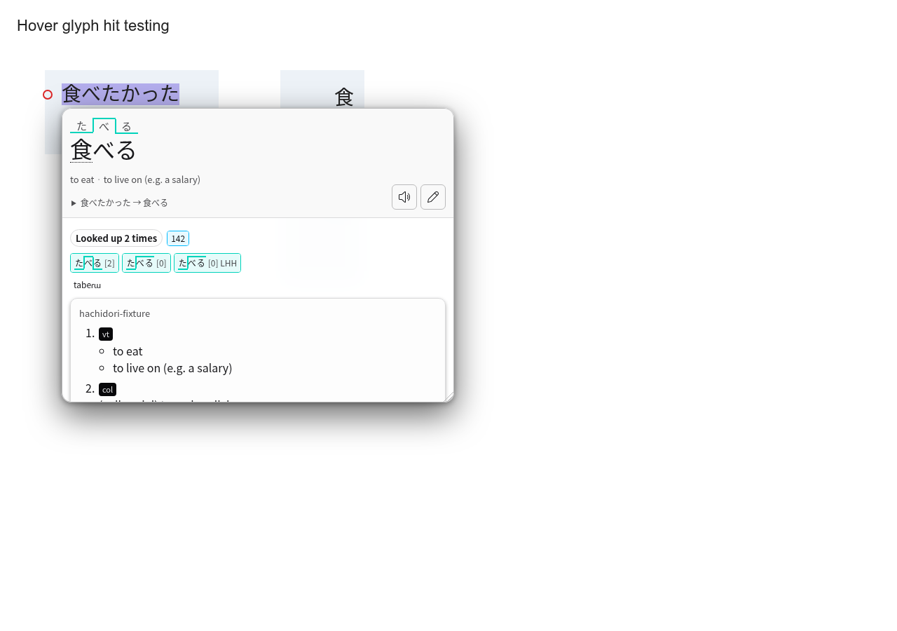
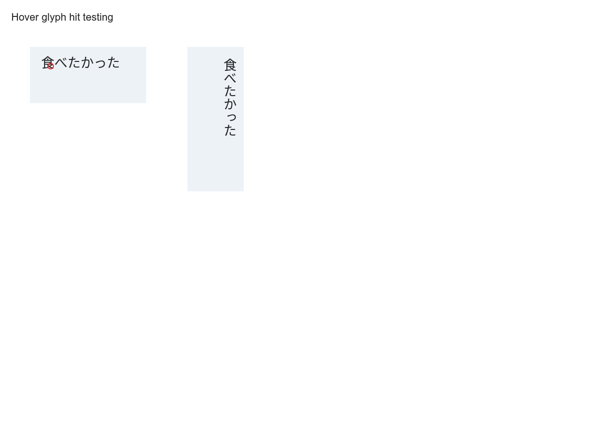
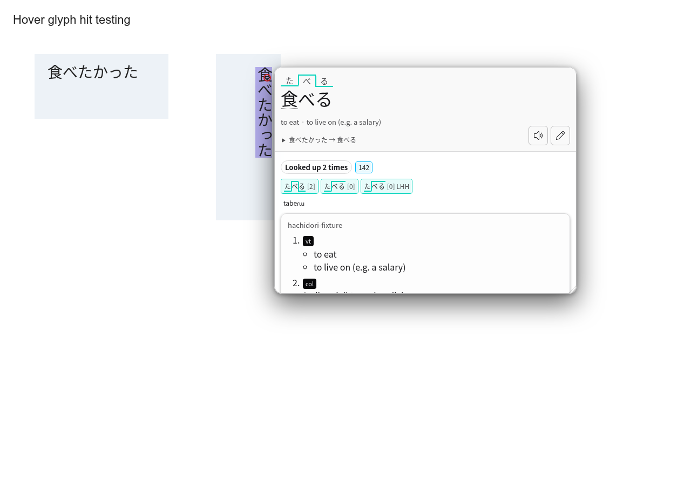
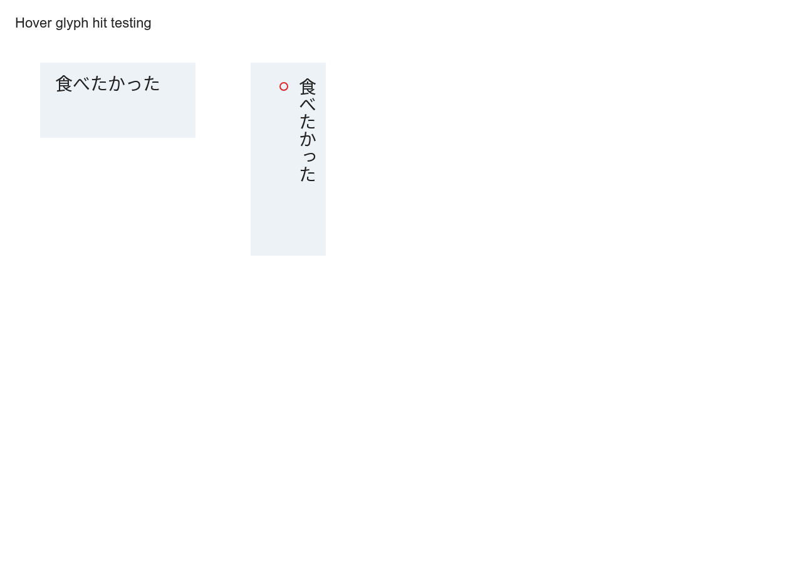

<!-- SPDX-License-Identifier: GPL-3.0-or-later -->

# Hover hit-testing evidence (#294)

The red ring marks the actual pointer position. All screenshots below use
headless Chrome 152.0.7977.75. The baseline opens a popup from empty padding;
the fix accepts the glyph and rejects the padding or a transparent covering
sibling. Vertical glyphs remain readable.

| Before: padding | After: padding | After: glyph |
| --- | --- | --- |
|  |  |  |

| Covered text | Vertical glyph | Vertical padding |
| --- | --- | --- |
|  |  |  |

The [point below the label](below-label.png) is also rejected. The separate
[GSM overlay screenshot](gsm-popup.png) comes from the existing overlay suite,
which passed its boxed-glyph hover, forward/backward exact drags, trailing-box
margins and host ownership checks.

[Benchmark raw timings and environment](benchmark.json) compare extension source
`4be36f5e87ab946574d6c0279c6e7dd6fee36c45` with
`d6676d6af390ebcd494b2e57b851c401ad69f7ee`, using the same harness and probe.
Node 22.23.1, Chrome 152.0.7977.75, Intel Core Ultra 7 165U, three fresh profiles
per version, a two-entry 525-byte fixture, eight measured warm root hovers per
profile, and 1,000 synchronous calls per point/profile after 100 warmups:

| Measurement | Before | After |
| --- | --- | --- |
| Warm first result, median / p95 (ms) | 16.9 / 20.1 | 16.9 / 17.2 |
| Warm complete result, median / p95 (ms) | 33.2 / 37.6 | 33.2 / 33.3 |
| Glyph resolution, three profile means (ms) | 0.0386, 0.0154, 0.0251 | 0.0318, 0.0247, 0.0398 |
| Padding resolution, three profile means (ms) | 0.0312, 0.0125, 0.0124 | 0.0069, 0.0072, 0.0070 |
| Glyph candidates accepted | 3000 / 3000 | 3000 / 3000 |
| Padding candidates accepted | 3000 / 3000 (bug) | 0 / 3000 |

Run the [hover benchmark](../../../benchmark/README.md#hover-popup-and-glyph-hit-testing)
with `HACHIDORI_HOVER_SAMPLES=3`; `HACHIDORI_BENCH_REPO` selects a frozen baseline
repository directory. The baseline copy's extension SHA-256 matches the initial
run before the runtime edit. Its manifest `revision` is the enclosing worktree
HEAD, while `extensionSourceRevision` records the actual source being measured.

These are shared-host samples. The small fixture isolates this hit-test path;
it does not establish large-library performance or a general speedup. Synchronous
resolution excludes scheduling, messaging, lookup and painting. The popup metrics
include them and are subject to frame timing and concurrent machine load.
