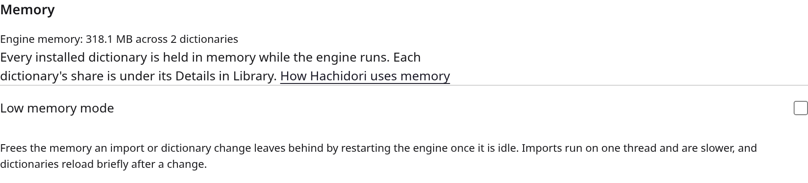
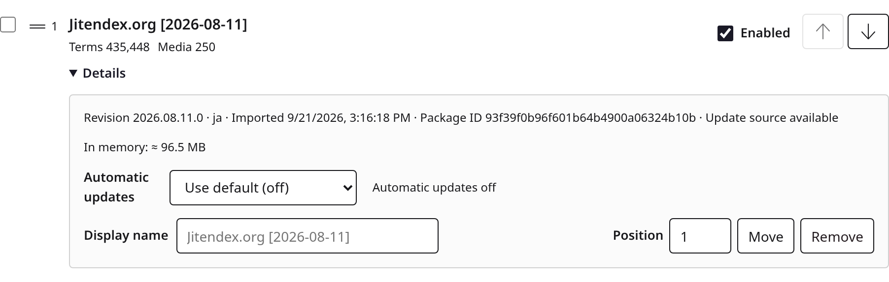

# Memory

Hachidori keeps every installed dictionary in memory while the engine runs. A
library of large, media-heavy dictionaries can therefore take a few gigabytes of
RAM where a dictionary extension that reads from IndexedDB on demand takes a few
hundred megabytes. This page explains where the bytes go, what Settings shows
about them, what **Low memory mode** does and costs, and what happens when the
dictionaries do not fit.

## Why the engine is large

The dictionary engine ([hoshidicts](https://github.com/bee-san/hoshidicts),
compiled to WebAssembly) opens each installed dictionary's generated files with
`mmap`: `hash.table`, `bloom.filter`, `blobs.bin`, and, when present,
`media.bin`, `media.idx` and `scan.idx`. Natively that costs nothing until a page
is touched. WebAssembly has no demand paging, so Emscripten emulates `mmap` by
allocating the whole file inside the module's linear memory and copying the
bytes in. Four things follow:

- **Every byte of every installed dictionary is resident**, media included,
  whether or not you ever look a word up in it. A dictionary's share is the size
  of its generated files, and the engine maps those files once for each kind it
  loads the package as (term, frequency, pitch, kanji), so a package that
  carries several banks holds several copies.
- **Linear memory never shrinks.** Importing a dictionary unzips it, builds its
  indexes and, on the threaded engine, runs an eight-thread worker group. On
  direct OPFS that work happens in a separate import worker that is terminated
  afterwards, so its peak is returned to the browser and the engine's heap grows
  only by the new dictionary's mapped files; on IDBFS (Electron, Firefox) the
  import runs inside the engine and the memory that peak needs is kept for the
  life of the engine worker. Disabling or removing a dictionary frees its
  mapping inside the heap, but the heap itself stays at its high-water mark.
- **IDBFS hosts hold a second copy.** Electron (GameSentenceMiner), Firefox, and
  Chrome without OPFS sync access handles keep the dictionary files in
  IndexedDB and mirror them into the WebAssembly filesystem, so the same bytes
  exist twice in JavaScript memory.
- **The heap is capped at 4 GiB** (`-sMAXIMUM_MEMORY=4GB` in
  `wasm/CMakeLists.txt`). A library whose mapped files exceed that cannot load
  completely.

## Reading the numbers

Settings → Advanced → **Memory** shows *Engine memory: X GB across N
dictionaries*: the size of the engine's linear memory and the number of loaded
packages.

Each row in Library shows *In memory: ≈ Y MB* under **Details**: that
package's mapped bytes as described above.

 Both come from the engine's
`hd_memory` read (see [architecture.md](architecture.md), "Runtime messages"),
asked for when you open Advanced (and again there when the engine publishes a
new generation after an import, reload or recycle) and when you open a row's
Details; nothing polls. While the engine is busy or unreachable the readout shows an em
dash rather than an error.

The total is usually larger than the sum of the rows: the difference is the
import high-water mark and the engine's own allocations. Media-heavy
dictionaries (images, audio) are the expensive ones; a text-only dictionary
with tens of thousands of entries is a few tens of megabytes.

## Low memory mode

Settings → Advanced → Memory → **Low memory mode** (off by default) does two
things:

1. **Recycles the engine worker after changes.** Once an import, reimport,
   update, removal, enable/disable, custom-dictionary save or backup
   restore has settled and the engine has been idle for two seconds, the
   offscreen document terminates the engine worker and starts a new one, which
   reloads the installed dictionaries from OPFS (or IDBFS). The new worker's
   heap holds only the mapped files: on IDBFS that gives the import high-water
   mark back to the browser, and on OPFS (where the import worker already
   returned it) whatever the swaps of replaced generations left in the heap.
   A pure reorder uses the already loaded native set and
   allocates no import high-water mark, so it does not request a recycle. It
   still restarts the idle window of a pending import or mode-change recycle.
2. **Imports on one thread with a minimal thread pool.** The recycled worker
   starts with a two-thread pool (one importer thread plus the WasmFS OPFS
   proxy) instead of up to nine, and `hdw_import` runs in its low-RAM mode.

Lookup speed is unchanged. The costs are that imports take longer (Jitendex in
about 3.9 s single-threaded instead of 1.6 s in the eight-thread group), and
that dictionaries reload briefly after a change: hover lookups during that
reload wait for the engine, and Settings shows *Starting the engine and loading
dictionaries…* for the reload's duration (about 1 ms per MB of dictionary
files). Turning the mode on or off also recycles the worker once, so the pool
size and the import threading always match the option.

The mode needs the dedicated engine worker. It is not offered on Firefox, where
the engine runs in the background page's iframe, nor when the offscreen
document has fallen back to the single-thread engine (`hd_status` reports
`threaded: false`); the readout stays available there.

Implementation: `extension/engine-recycler.js` is the pure scheduler,
`extension/offscreen.js` owns the idle predicate (no pending request, and no
engine-side state a later request still needs, such as a prepared backup, an
exported archive URL or an open dictionary download) and the restart,
`extension/engine-worker-runtime.js` reads the worker's name to size the
pthread pool before the module starts, and `background.js` answers
`hd_engine_config` for the offscreen document and pushes the option when it
changes.

## When dictionaries do not fit

There are two failure regimes.

**More than 4 GiB of mapped files.** `memory.grow` is refused, the engine's
`mmap` fails with `ENOMEM`, and the package that did not fit is reported in
`hd_status.failedDictionaries` with *not enough memory to load … dictionary*.
Nothing crashes: the other dictionaries keep working, Settings names the
package that failed, and the fix is to disable or remove the largest
dictionaries (media-heavy ones first) until the rest fits. Before this message
existed the same failure read like a damaged file.

**Less than 4 GiB, but more than the operating system can keep resident.**
Nothing in the engine can see this. The browser swaps, which shows up as
hovers taking seconds, or the operating system kills the extension process;
the service worker then recreates the offscreen document, which reloads every
dictionary and hits the same wall. If Hachidori's memory is close to what your
machine has free, remove or disable the largest dictionaries, and turn on Low
memory mode so that imports do not add their high-water mark on top.

## Deferred

Making the footprint scale with use rather than with what is installed needs
changes in hoshidicts: reading `media.bin` on demand through the kept file
descriptor under Emscripten (free on the lookup path, since media is fetched by
path), and optionally `blobs.bin` on demand behind the same switch at a lookup
speed cost. A later round may also retry a load that failed for memory with
on-demand reads before reporting it. Further out, the WebAssembly
[memory-control proposal](https://github.com/WebAssembly/memory-control)
(`memory.discard` in phase 1, mappable memory later) would let an engine give
pages back or map files without copying them, at which point the emulation
described above stops being the constraint.
