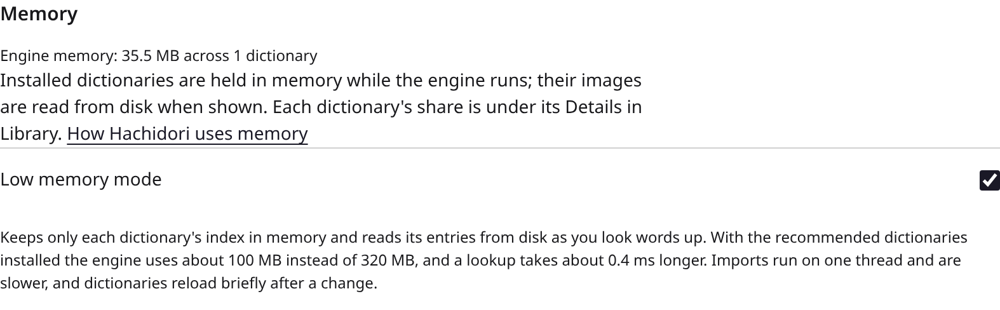
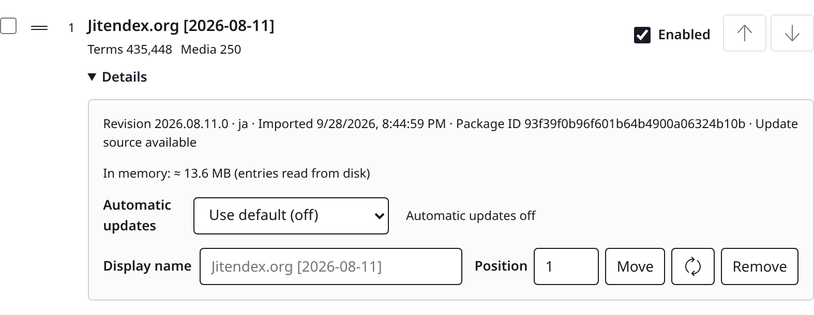

# Memory

Hachidori keeps the installed dictionaries' text in memory while the engine
runs, and reads their images from disk when they are shown. A library of large
dictionaries can therefore take a gigabyte or more of RAM, where a dictionary
extension that reads from IndexedDB on demand takes a few hundred megabytes.
**Low memory mode** keeps only each dictionary's index in memory and reads the
entries from disk as they are looked up. This page explains where the bytes
go, what Settings shows about them, what Low memory mode does and costs, and
what happens when the dictionaries do not fit.

## Why the engine is large

The dictionary engine ([hoshidicts](https://github.com/bee-san/hoshidicts),
compiled to WebAssembly) opens each installed dictionary's generated files with
`mmap`: its index (`hash.table`, `bloom.filter` and, when present, `media.idx`,
`scan.idx` and the trained `dict.zstd`) and its entries (`blobs.bin`). Natively
that costs nothing until a page is touched. WebAssembly has no demand paging, so
Emscripten emulates `mmap` by allocating the whole file inside the module's
linear memory and copying the bytes in. Five things follow:

- **Every entry of every installed dictionary is resident**, whether or not you
  ever look a word up in it. A dictionary's share is the size of its index and
  entry files, once however many kinds it loads as (term, frequency, pitch,
  kanji): the kinds share one copy.
- **Images and other media are not.** `media.bin` is never copied in; the
  engine reads a file from OPFS (or IDBFS) when a popup or an Anki export asks
  for it, and the popup caches what it shows.
- **Linear memory never shrinks.** Importing a dictionary unzips it, builds its
  indexes and, on the threaded engine, runs an eight-thread worker group. On
  direct OPFS that work happens in a separate import worker that is terminated
  afterwards, so its peak is returned to the browser and the engine's heap grows
  only by the new dictionary's resident files; on IDBFS (Electron) the
  import runs inside the engine and the memory that peak needs is kept for the
  life of the engine worker. Disabling or removing a dictionary frees its
  files inside the heap, but the heap itself stays at its high-water mark.
- **IDBFS hosts hold a second copy.** Electron (GameSentenceMiner) and
  Chrome without OPFS sync access handles keep the dictionary files in
  IndexedDB and mirror them into the WebAssembly filesystem, so every file,
  media included, also exists in JavaScript memory.
- **The heap is capped at 4 GiB** (`-sMAXIMUM_MEMORY=4GB` in
  `wasm/CMakeLists.txt`). A library whose resident files exceed that cannot
  load completely; see [When dictionaries do not fit](#when-dictionaries-do-not-fit).

With the five recommended dictionaries (75 MB of archives) the engine heap is
about 320 MB after the import, and about 100 MB in Low memory mode (Chrome 152,
direct OPFS; `benchmark/low-memory-mode.mjs`).

## Reading the numbers

Settings → Advanced → **Memory** shows *Engine memory: X GB across N
dictionaries*: the size of the engine's linear memory and the number of loaded
packages.

Each row in Library shows *In memory: ≈ Y MB* under **Details**: that
package's resident files as described above. A package whose entries are read
from disk (every package in Low memory mode, or one that did not fit) counts
only its index and says *(entries read from disk)*.

Both come from the engine's `hd_memory` read (see
[architecture.md](architecture.md), "Runtime messages"), asked for when you open
Advanced (and again there when the engine publishes a new generation after an
import, reload or recycle) and when you open a row's Details; nothing polls.
While the engine is busy or unreachable the readout shows an em dash rather than
an error.

The total is usually larger than the sum of the rows: the difference is the
import high-water mark, the engine's own allocations and, in Low memory mode,
the cache of recently read entry pages (`hd_memory.pageCacheBytes`, at most
32 MiB once a lookup returns). A text-only dictionary with tens of thousands of
entries is a few tens of megabytes; the largest name dictionaries are several
hundred.

## Low memory mode

Settings → Advanced → Memory → **Low memory mode** (off by default) does three
things:

1. **Reads dictionary entries from disk.** The worker keeps each dictionary's
   index in the heap and reads `blobs.bin` from OPFS (or IDBFS) through a page
   cache: 4 KiB pages, 32 MiB for all dictionaries together, least recently
   used first out. Every probe still reads the index in memory, so a lookup
   that finds nothing reads nothing from disk, and one that does reads only the
   pages holding the entries it finds. Results are identical with the mode on
   and off. A lookup keeps the pages it read until it returns, so the cache can
   exceed its budget while one runs.
2. **Recycles the engine worker after changes.** Once an import, reimport,
   update, removal, enable/disable, custom-dictionary save or backup
   restore has settled and the engine has been idle for two seconds, the
   offscreen document terminates the engine worker and starts a new one, which
   reloads the installed dictionaries from OPFS (or IDBFS). The new worker's
   heap holds only the index files: on IDBFS that gives the import high-water
   mark back to the browser, and on OPFS (where the import worker already
   returned it) whatever the swaps of replaced generations left in the heap.
   A pure reorder uses the already loaded native set and
   allocates no import high-water mark, so it does not request a recycle. It
   still restarts the idle window of a pending import or mode-change recycle.
3. **Imports on one thread with a minimal thread pool.** The recycled worker
   starts with a two-thread pool (one importer thread plus the WasmFS OPFS
   proxy) instead of up to nine, and `hdw_import` runs in its low-RAM mode.

Measured with the five recommended dictionaries on Chrome 152 (direct OPFS,
`benchmark/low-memory-mode.mjs`, 1,000 hovers over example sentences looked up
two to five times over, round trips from the settings page, ten fresh profiles
each way): the heap goes from about 320 MB to about 70 MB right after loading
(41 MB of index files) and about 100 MB once the cache has filled, and the
median hover round trip from 3.5 ms to 3.9 ms (p95 10.7 ms to 11.7 ms). The first
pass over the hovers, with the cache still empty, costs the same. On a shared
machine single samples vary by several tenths of a millisecond either way. The
engine itself does about 7% more work per lookup when it reads entries through
the cache (Node, same hovers).

The other costs are that imports take longer (Jitendex in about 3.9 s
single-threaded instead of 1.6 s in the eight-thread group), and that
dictionaries reload briefly after a change: hover lookups during that reload
wait for the engine, and Settings shows *Starting the engine and loading
dictionaries…* for the reload's duration (about 1 ms per MB of index files).
Turning the mode on or off also recycles the worker once, so the pool size,
the import threading and how the entries are read always match the option.

On OPFS the engine keeps each paged `blobs.bin`, and each `media.bin`, open
through a sync access handle, which locks the file for as long as its package
is loaded. A worker that opens a file another context still holds reads it
through a slower `Blob` instead of failing.

The mode needs the dedicated engine worker. It is not offered when the offscreen
document has fallen back to the single-thread engine (`hd_status` reports
`threaded: false`); the readout stays available there.

Implementation: hoshidicts `DictionaryStorage::Paged` (`src/blob_file.cpp`,
`src/memory/page_cache.cpp`) reads the pages;
`extension/engine-recycler.js` is the pure scheduler,
`extension/offscreen.js` owns the idle predicate (no pending request, and no
engine-side state a later request still needs, such as a prepared backup, an
exported archive URL or an open dictionary download) and the restart,
`extension/engine-worker-runtime.js` reads the worker's name to size the
pthread pool before the module starts and asks `engine-service.js` to load every
package paged (`hd_status.pagedDictionaries`), and `background.js` answers
`hd_engine_config` for the offscreen document and pushes the option when it
changes.

## When dictionaries do not fit

There are two failure regimes.

**More than 4 GiB of resident files.** `memory.grow` is refused and the
engine's `mmap` fails with `ENOMEM` (*not enough memory to load … dictionary*).
The engine then loads that package again with its entries read from disk, as
Low memory mode would, so only its index has to fit; its Library row says
*(entries read from disk)* and its lookups cost what they cost in Low memory
mode. A package whose index does not fit either is reported in
`hd_status.failedDictionaries`. Nothing crashes: the other dictionaries keep
working, Settings names the package that failed, and the fix is to turn on Low
memory mode or to disable or remove the largest dictionaries until the rest
fits. With Low memory mode on only the indexes count towards the limit, so on
OPFS a library can hold several times 4 GiB of dictionary files.

**Less than 4 GiB, but more than the operating system can keep resident.**
Nothing in the engine can see this. The browser swaps, which shows up as
hovers taking seconds, or the operating system kills the extension process;
the service worker then recreates the offscreen document, which reloads every
dictionary and hits the same wall. If Hachidori's memory is close to what your
machine has free, turn on Low memory mode, or remove or disable the largest
dictionaries.

## Deferred

On IDBFS hosts the MEMFS mirror still holds every file in JavaScript memory;
reading IndexedDB records on demand would need an IDBFS backend of its own.
Which pages stay resident is decided by the cache alone; keeping common words or
the first-ranked dictionaries warm is investigated in
[#344](https://github.com/bee-san/hachidori/issues/344). Further out, the
WebAssembly [memory-control proposal](https://github.com/WebAssembly/memory-control)
(`memory.discard` in phase 1, mappable memory later) would let an engine give
pages back or map files without copying them, at which point the emulation
described above stops being the constraint.
