<!-- SPDX-License-Identifier: GPL-3.0-or-later -->
# Bee's Theme

Enable **Advanced → Experimental features → Theme Store**, then open **Design**
and select **Bee's Theme**.

The theme puts Girlypop's blush, magenta and violet palette on JL's compact
layout, typography and repeated header for each dictionary. Brighter text
accents keep the translucent surface readable at the default opacity. Group
tabs use JL's label-sized buttons and spacing in Bee's colours. Selected groups
have an underline and keyboard focus has a visible violet outline.

- **Group tabs:** All shows every result, followed by configured groups with
  results in their saved order. A group filters existing blocks in place and
  audio, mining and keyboard actions follow its visible dictionaries. Without
  matching groups, all results appear without a tab row. The Design preview
  labels its fallback groups Sample definitions and Sample examples. Back
  restores an explicitly selected group; See links start in All. Presentation
  changes preserve deliberate tab focus.
- **Formatted definitions:** each dictionary block shows only the existing
  structured glossary renderer's lists, tables, furigana, links and images. JL's
  plain text and JMdict tag brackets (`[★, priority form] [n, adv]`) do not
  appear. Kanji blocks show formatted meanings, then JL's On/Kun/Statistics
  lines. Scoped dictionary CSS applies to the content. The existing media
  service and link handlers retain request ownership.
- **Controls:** audio, Anki and the pencil sit together after the dictionary
  name as identical icon buttons, using Hachidori's outline icon set at one size
  in the text colour. All actions have the same four-pixel gap, including custom
  buttons. Word and reading lead the header, frequencies wrap independently,
  and the dictionary name shares a separate row with actions. Long names shrink
  with an ellipsis; hovering them shows the full name. Every enabled control shows a pointer cursor. Back sits at the
  popup's upper left, including when Close is also available.
- **Design settings:** compact glossaries, frequency dictionary names, compact
  frequency numbers, frequency averages and contour/overline pitch markings
  use the same options as Default. Frequency changes update the open view
  without rebuilding definitions or losing a Note draft.
- **Image preview:** hovering or focusing a glossary image shows Default's
  enlarged copy beside the popup, following Design → Definitions → Image hover
  preview (Off, Large images only, All images).
- **Personal dictionary:** each block's pencil opens the shared Term, Reading
  and Definition form beneath its header. Exact selections prefill the selected
  text. Escape closes the form first; group presentation updates preserve drafts.
- **Custom actions:** buttons configured in Design → Custom buttons appear
  beside the existing controls; an unconfigured theme has none. The first two
  use external-link and add-card icons, with their names in hover titles and
  accessible labels. More actions lists the remainder with icons and names.
  Escape closes More actions and returns focus to its trigger before
  closing a Note form or the popup. Selecting an action or pressing outside the
  menu also closes it. Each mining button receives its own dictionary's definitions.
- **Child lookups:** glossary words follow the page's hover or activation mode,
  including after clicking a dictionary disclosure. See links open the complete
  target with all dictionaries visible; the parent keeps its selected group.

The theme shares JL's direct renderer and Default's lookup-action component.
It builds its own popup and stylesheet. Sources and attribution are in
`extension/vendor/themes/bee/`; `source.json` records the upstream base revision.
The bundled renderer also includes the locally reviewed layout, navigation and
frequency-update refinements described here.

The screenshots configure optional actions named **Custom button** to show their
icon and More menu placement. A new installation has no custom buttons.

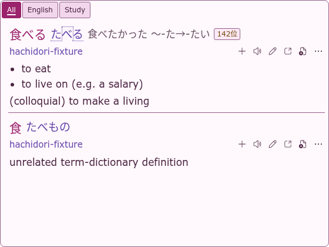
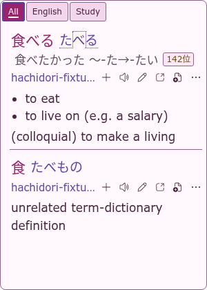
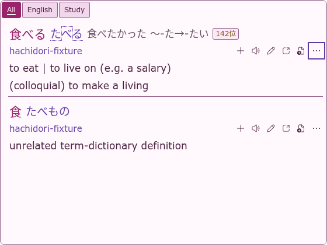

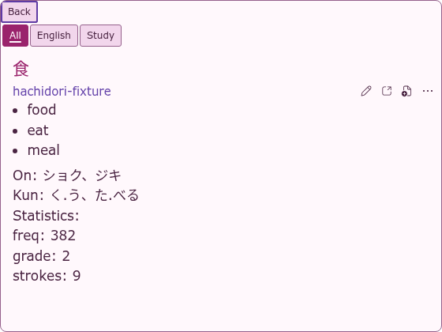
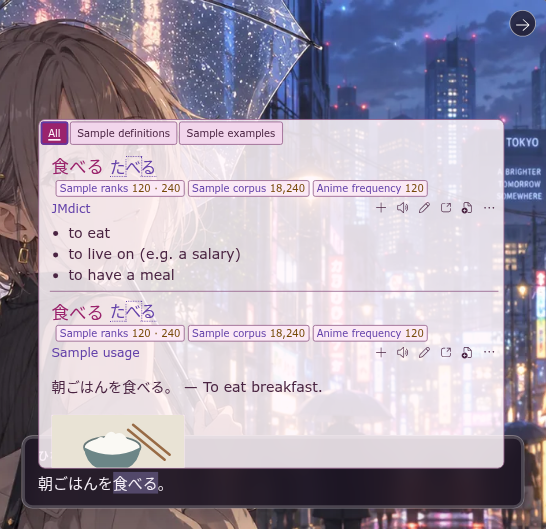
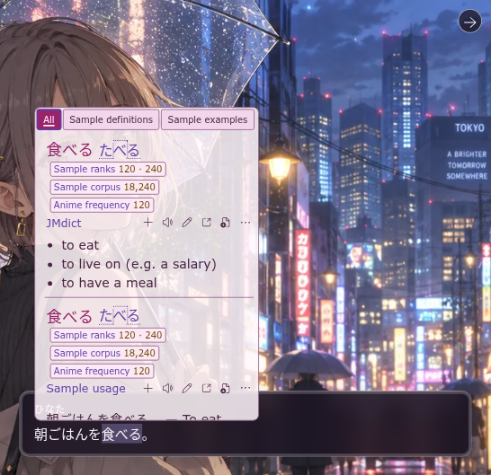
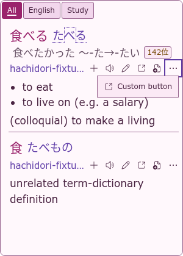


## Validation

The focused theme test uses the real extension, WASM importer and a local fake
AnkiConnect. It checks the Store selection, All and group tabs, inline custom
actions, formatted-only content, uniform action icons, Note/Escape, kanji,
structured tables, loaded dictionary images and the enlarged image preview,
plus switching back to Default. Forced-colour screenshots
cover the new layout in both light and dark system palettes. Browser assertions
check WCAG AA text contrast (4.5:1) and control/focus contrast (3:1) with the
default popup opacity composited over both white and black pages.

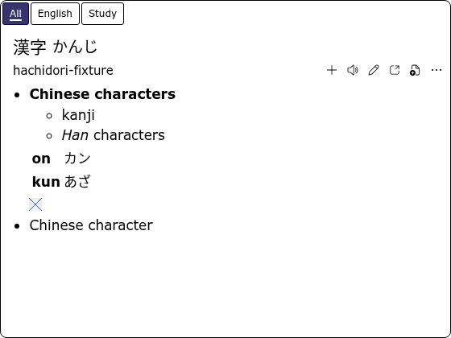
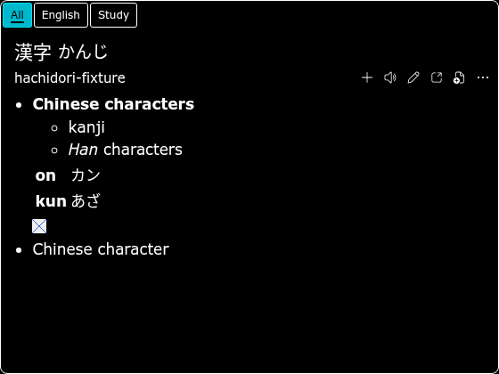
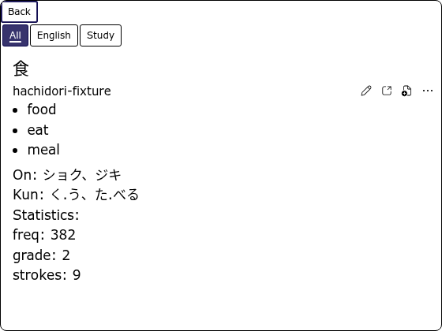
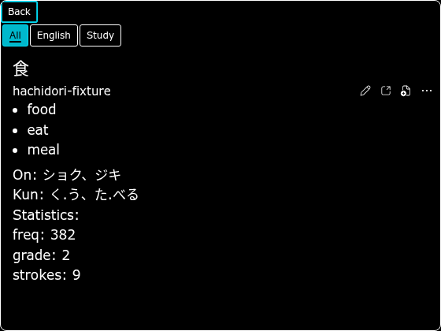

[45-palette contrast filmstrip](../assets/bee/theme-contrast.png).

## Performance

The latest UI refinements and Bee-only before/after measurements are in the
[Bee UI performance report](bee-ui-performance.md).

Measurements use the existing production hover harness with the same synthetic
flat, 40-level structured and 24-sense entries. Bee's Theme now builds each
block's formatted glossary during the initial render, so its row includes that
construction; media decoding remains asynchronous.

| Renderer / revision | First display, median / p95 | Complete display, median / p95 | Synchronous render, median / p95 |
| --- | ---: | ---: | ---: |
| JL before | 16.80 / 17.70 ms | 33.20 / 33.50 ms | 0.95 / 1.50 ms |
| JL after | 16.80 / 17.10 ms | 33.20 / 33.90 ms | 1.00 / 2.00 ms |
| Default before | 17.00 / 18.20 ms | 33.30 / 35.40 ms | 2.50 / 5.50 ms |
| Default after | 16.90 / 18.10 ms | 33.30 / 33.40 ms | 3.00 / 5.80 ms |
| Bee's Theme (Miku, deferred formatting) | 16.80 / 17.60 ms | 33.20 / 33.50 ms | 1.20 / 1.80 ms |
| Bee's Theme (formatted only, `f62a0d4`) | 16.80 / 17.10 ms | 33.30 / 33.50 ms | 1.30 / 2.70 ms |

Each row uses three fresh Chrome profiles and 72 measured warm lookups. The
harness excludes an alternating warmup pair per profile and retains cold,
nested, rapid-replacement and correctness samples in the raw evidence.
Baseline revision is `ed2f340`; the local JL/Default comparison checkout was
`d5047b2`. The deferred-formatting Miku Bee run uses local snapshot `6c7f7cc`;
manifests retain full measurement SHAs and hashes. Earlier Girlypop
measurements are also retained in the evidence.

The formatted-only row (`formatted-bee-*` in the evidence) was measured on
Linux, Intel Xeon Platinum 8488C (16 logical CPUs), Node 22.23.1, Chrome
152.0.7977.75 and the pinned test tooling; the earlier rows used an AMD EPYC
9V74 (9 logical CPUs exposed). Compare rows within one machine, not across.
The Theme Store's `Render 1.30 ms` label is this row's synchronous render
median; the other themes' labels come from the [four-theme benchmark](benchmark.md)
on the same Xeon model. Profiles run sequentially. These synthetic dictionaries
isolate popup work; they do not represent a large dictionary library.
First/complete timings are frame-quantised. Formatted-only Bee's median element
count rises from 24 to 66 (p95 43 to 270) and every block now calls the shared
glossary renderer, yet warm first and complete display stay in the same frames.
Custom actions and group switching are covered by the focused browser suite
rather than this microbenchmark.

To reproduce, check out `ed2f340` for the baseline rows, `feat/bees-theme`
for the after/deferred Bee rows, or `f62a0d4` for the formatted-only row. Use the `popupTheme` value from
the corresponding manifest (`jl`, `default` or `bee`):

```sh
HACHIDORI_BENCH_REPO=/path/to/checkout \
HACHIDORI_PUPPETEER=/path/to/puppeteer-core.js \
HACHIDORI_CHROME=/path/to/chrome \
HACHIDORI_HOVER_OPTIONS='{"popupTheme":"bee"}' \
  node benchmark/hover-popup.mjs /tmp/bee-results \
  docs/themes/bee-evidence/bee-hover-fixture.zip \
  docs/themes/bee-evidence/bee-senses.zip
```

[Summary and raw samples](bee-evidence/) include archive checksums and every
measured result. Medians average the middle pair; p95 uses nearest rank.
