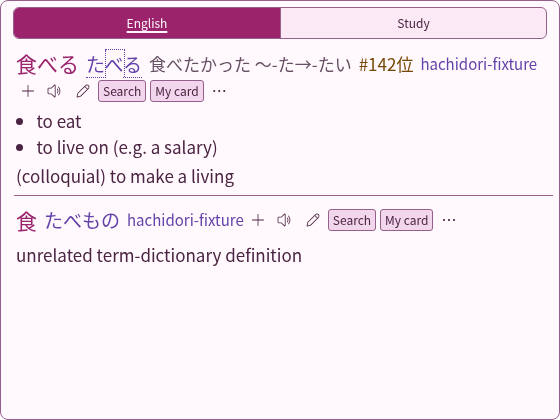
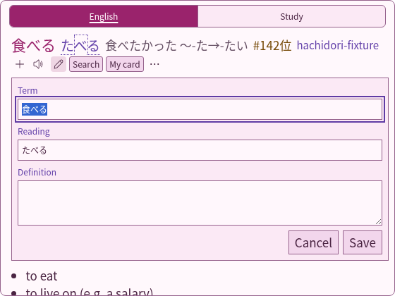
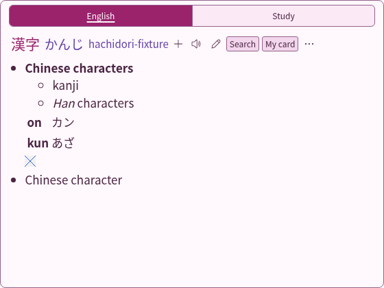
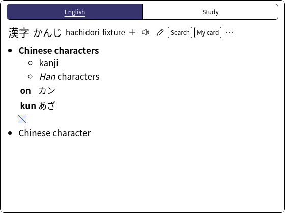
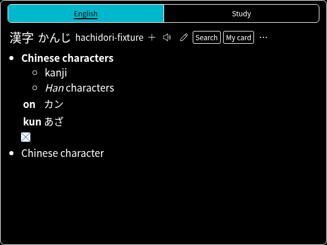

<!-- SPDX-License-Identifier: GPL-3.0-or-later -->
# Bee's Theme

Enable **Advanced → Experimental features → Theme Store**, then open **Design**
and select **Bee's Theme**.

The theme puts Girlypop's blush, magenta and violet palette on JL's compact
layout, typography and repeated header for each dictionary. Existing frequency
text and pitch markings follow JL. Brighter text accents keep the translucent
surface readable at the default opacity. Group tabs have equal widths and share
one frame without gaps. Selected groups have an underline and keyboard focus
has a visible violet outline.

- **Group tabs:** only configured groups with results appear, in their saved
  order. A group filters existing blocks in place and audio, mining and keyboard
  actions follow its visible dictionaries. Without matching groups, all results
  appear without a tab row. Back restores the selected group.
- **Formatted definitions:** each dictionary block shows only the existing
  structured glossary renderer's lists, tables, furigana, links and images. JL's
  plain text and JMdict tag brackets (`[★, priority form] [n, adv]`) do not
  appear. Kanji blocks show formatted meanings, then JL's On/Kun/Statistics
  lines. Scoped dictionary CSS applies to the content. The existing media
  service and link handlers retain request ownership.
- **Controls:** audio, Anki and the pencil sit together after the dictionary
  name as identical icon buttons, using Hachidori's outline icon set at one size
  in the text colour. Every enabled control shows a pointer cursor. In the
  kanji view, Back sits top left, aligned with the group tabs.
- **Image preview:** hovering or focusing a glossary image shows Default's
  enlarged copy beside the popup, following Design → Definitions → Image hover
  preview (Off, Large images only, All images).
- **Personal dictionary:** each block's pencil opens the shared Term, Reading
  and Definition form beneath its header. Exact selections prefill the selected
  text. Escape closes the form first; group presentation updates preserve drafts.
- **Custom actions:** configured link and Anki-template buttons appear beside the
  existing controls. The first two stay inline, with the remainder in More
  actions. Each mining button receives its own dictionary's definitions.

The theme shares JL's direct renderer and Default's lookup-action component.
It builds its own popup and stylesheet. Sources and attribution are in
`extension/vendor/themes/bee/`; `source.json` records the reviewed source revision.






## Validation

The focused theme test uses the real extension, WASM importer and a local fake
AnkiConnect. It checks the Store selection, group-only tabs, inline custom
actions, formatted-only content, uniform action icons, Note/Escape, kanji,
structured tables, loaded dictionary images and the enlarged image preview,
plus switching back to Default. Forced-colour screenshots
cover the new layout in both light and dark system palettes. Browser assertions
check WCAG AA text contrast (4.5:1) and control/focus contrast (3:1) with the
default popup opacity composited over both white and black pages.




## Performance

Measurements use the existing production hover harness with the same synthetic
flat, 40-level structured and 24-sense entries. Bee's Theme now builds each
block's formatted glossary during the initial render, so its row includes that
construction; media decoding remains asynchronous.

| Renderer / revision | First display, median / p95 | Complete display, median / p95 | Synchronous render, median / p95 |
| --- | ---: | ---: | ---: |
| JL before | 16.80 / 17.70 ms | 33.20 / 33.50 ms | 0.95 / 1.50 ms |
| JL after | 16.80 / 17.10 ms | 33.20 / 33.90 ms | 1.00 / 2.00 ms |
| Default before | 17.00 / 18.20 ms | 33.30 / 35.40 ms | 2.50 / 5.50 ms |
| Default after | 16.90 / 18.10 ms | 33.30 / 33.40 ms | 3.00 / 5.80 ms |
| Bee's Theme (Miku, deferred formatting) | 16.80 / 17.60 ms | 33.20 / 33.50 ms | 1.20 / 1.80 ms |
| Bee's Theme (formatted only, `f62a0d4`) | 16.80 / 17.10 ms | 33.30 / 33.50 ms | 1.30 / 2.70 ms |

Each row uses three fresh Chrome profiles and 72 measured warm lookups. The
harness excludes an alternating warmup pair per profile and retains cold,
nested, rapid-replacement and correctness samples in the raw evidence.
Baseline revision is `ed2f340`; the local JL/Default comparison checkout was
`d5047b2`. The deferred-formatting Miku Bee run uses local snapshot `6c7f7cc`;
manifests retain full measurement SHAs and hashes. Earlier Girlypop
measurements are also retained in the evidence.

The formatted-only row (`formatted-bee-*` in the evidence) was measured on
Linux, Intel Xeon Platinum 8488C (16 logical CPUs), Node 22.23.1, Chrome
152.0.7977.75 and the pinned test tooling; the earlier rows used an AMD EPYC
9V74 (9 logical CPUs exposed). Compare rows within one machine, not across.
The Theme Store's `Render 1.30 ms` label is this row's synchronous render
median; the other themes' labels come from the [four-theme benchmark](benchmark.md)
on the same Xeon model. Profiles run sequentially. These synthetic dictionaries
isolate popup work; they do not represent a large dictionary library.
First/complete timings are frame-quantised. Formatted-only Bee's median element
count rises from 24 to 66 (p95 43 to 270) and every block now calls the shared
glossary renderer, yet warm first and complete display stay in the same frames.
Custom actions and group switching are covered by the focused browser suite
rather than this microbenchmark.

To reproduce, check out `ed2f340` for the baseline rows, `feat/bees-theme`
for the after/deferred Bee rows, or `f62a0d4` for the formatted-only row. Use the `popupTheme` value from
the corresponding manifest (`jl`, `default` or `bee`):

```sh
HACHIDORI_BENCH_REPO=/path/to/checkout \
HACHIDORI_PUPPETEER=/path/to/puppeteer-core.js \
HACHIDORI_CHROME=/path/to/chrome \
HACHIDORI_HOVER_OPTIONS='{"popupTheme":"bee"}' \
  node benchmark/hover-popup.mjs /tmp/bee-results \
  docs/themes/bee-evidence/bee-hover-fixture.zip \
  docs/themes/bee-evidence/bee-senses.zip
```

[Summary and raw samples](bee-evidence/) include archive checksums and every
measured result. Medians average the middle pair; p95 uses nearest rank.
